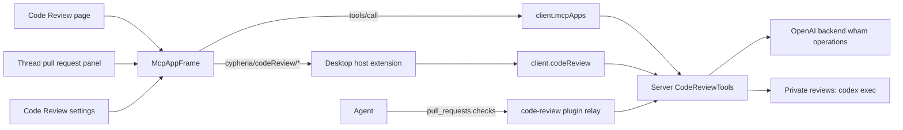

# Code Review

This document owns Cypheria's Code Review: the bundled `code-review` plugin, its MCP App, the OpenAI backend it reads pull requests through, private reviews, and the Desktop surfaces that host it. Local repository work, Review sources, and worktrees are in [Local Git design](git.md); the plugin lifecycle is in [Integrations](integrations.md#cypheria-app-tools).

## Prerequisites

Code Review reads and writes GitHub pull requests and GitLab merge requests only through OpenAI's backend, acting as the user's ChatGPT account. It runs no `gh` or `glab` command and holds no GitHub or GitLab credentials.

1. **ChatGPT sign-in.** Server asks the managed Codex App Server for `getAuthStatus` with `includeToken: true`, and refreshes the token once after a 401. An API-key sign-in or no sign-in leaves Code Review in its sign-in state.
2. **Connected accounts.** The user connects GitHub or GitLab to ChatGPT through the OpenAI GitHub or GitLab plugin's connector. ChatGPT may hold several GitHub connections (github.com and GitHub Enterprise hosts) and several GitLab connector instances; Code Review settings choose which one it uses.
3. **The `code-review` plugin.** Server installs it with the bundled marketplace; turning plugins off for an Agent removes `pull_requests.checks` from that Agent.

Without these, the Code Review page shows its onboarding step and the Thread pull request panel stays empty.

## Architecture

- **Server** (`apps/server/src/code-review`) owns the ChatGPT session, the backend client, the 31 `pull_requests.*` tools, private reviews, and the host-side provider calls.
- **The MCP App** (`packages/code-review-app`) is `ui://pull-requests/app`, one self-contained HTML document that the Server build copies into the bundled plugin's `assets/`. It renders onboarding, the pull request detail, Changes, and settings, and talks only through its MCP Apps channel.
- **Desktop** hosts the App in a sandboxed iframe (`McpAppFrame`) and answers its `cypheria/codeReview/*` host requests. The Code Review sidebar is drawn by Desktop from the sections the App reports.

## Tools

`CodeReviewTools` lists the same 31 tools as the official plugin. `pull_requests.checks` is the only model-visible tool; the rest carry `_meta.ui.visibility: ["app"]`, so Codex hides them from the model and only the App calls them.

| Group | Tools |
| --- | --- |
| Entry points | `open` (global or Thread surface), `settings` |
| Reading | account, search, summaries, body, metadata, reviews, discussion, diff, stack, review snapshot, revision diff and file, user search, media, rendered Markdown, review metadata, activity, reactions, saved searches, initial detail |
| Writing | update, merge, submit review, comment, comment update, review-thread update, reaction update |
| Private review | start, details, cancel, finding resolution |
| Agent | `checks` |

GitHub calls go to `/wham/github/operations/<operation>` with the ChatGPT account headers and `originator: Codex Code Review`; GitLab calls go to `/wham/gitlab/operations/<operation>`. Server accepts only trusted backend hosts, caches the GitHub account for 15 minutes, clears it after a 401, 403, or 409, and honors `retry-after` and `x-ratelimit-reset` by refusing calls until the retry time. GitLab merge request reads that the App makes outside a tool go through the host request `cypheria/codeReview/provider`, limited to a fixed operation list.

`pull_requests.checks` reads a GitHub pull request's checks through `gh-pr-checks` and a GitLab merge request's pipelines through `read-check-diagnostics`. It returns provider guidance and the next requests the Agent can make, without job logs.

## Private reviews

A private review asks Codex to review a pull request without a checkout. Server runs `codex exec --sandbox read-only` with a temporary `review_context` MCP server that exposes `read_diff`, `list_files`, and `read_file` for the fixed head and merge base. Findings must anchor to a diff hunk; unanchored findings are dropped. Results stay in Cypheria until the user posts a finding as a comment.

Runs are leased for 60 seconds and renewed while alive. At most two run at a time and a run times out after 15 minutes. A run whose lease expired is reported as interrupted and is never resumed automatically. The `code_reviews` table stores runs and findings; see [Database](database.md).

## Desktop surfaces

- **Code Review page** (`/code-review`, Sidebar item **Code Review**). The left sidebar shows Pinned, then the chosen sections (Authored by me, Needs my review, Needs my team's review, Approved, Drafts, Recently merged), search, and Compact or Detailed layout. The main pane is the App. A `?pr=` link opens that pull request.
- **Thread pull request panel.** The conversation's right panel has a **Pull request** tab with the same App detail on the Thread surface. Desktop finds the pull request from the Thread's attachments, or by searching the Thread branch's head through the App tools. The conversation header's branch menu offers View PR, Open in GitHub or GitLab, Copy link, and Add to chat, and Create PR prefills a composer prompt.
- **Detail.** Summary and Changes tabs; pin, copy link, and open in GitHub or GitLab; **Review with Codex** (private review or a new chat) with review instructions; the state, title editor, author, branches, description with reactions, activity filtered by All activity, All comments, Human comments, or Commits, and the comment box; a right rail with Threads, Comments, Reviews, and Checks with Fix actions; merge and Submit review dialogs. Changes shows the diff beside a filterable file tree, with inline threads and review comments.
- **Watch and fix.** On the Thread surface, the detail offers Watch and fix for an open pull request. Desktop creates a Server schedule that runs in that Thread every ten minutes with a prompt built from the Git watch preferences (auto-merge, merge method, and watch instructions) at creation time; the pause button pauses it, and Schedules can also pause or resume it.
- **Settings.** Settings > Code Review hosts the App's settings entry point: review provider, GitHub account or GitLab instance, where review links open, and review instructions. Settings are Server configuration under `codeReview`.

Opening a chat from Code Review (review, fix checks, fix comments, fix conflicts, or chat) starts a new chat with the official prompt and any attached context. Links follow the **Open review links in** setting: the Code Review tab, a page in Cypheria's browser, or the default browser.

## Host extension

The App and Desktop validate host requests and notifications with `@cypheria/protocol/code-review-app`. Requests cover setup, settings read and update, GitLab provider operations, sidebar state, connect, open link, open chat, the initial selection, linked Threads, open Thread, pins, and Watch and fix. Notifications carry the sidebar selection, sidebar actions (more or retry), search text, and settings changes. Resource reads arrive in 200,000-character pieces so a relay message limit cannot truncate the App.

The iframe has an opaque origin, allows scripts, forms, and popups, and carries an injected CSP from the resource's `_meta.ui.csp`; the App receives the host theme, locale, and the standard MCP style variables, and never receives a token or Node.js access.

## Validation status

Unit tests cover the backend client, tools, persistence, chunked resource reads, the diff splitter, and the watch helper. Live calls to OpenAI's backend with a real ChatGPT account have not been verified; GitLab response shapes follow the official App and are checked at runtime. See the [verification task](todo.md#local-git-and-pull-requests).
