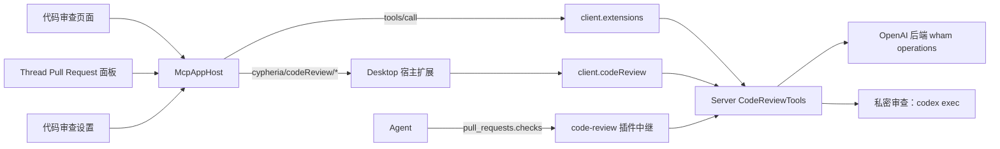

# 代码审查

本文档负责 Cypheria 的代码审查：内置的 `code-review` 插件、它的 MCP App、它读取 Pull Request 所经由的 OpenAI 后端、私密审查，以及承载它的 Desktop 界面。本地仓库操作、Review 来源和工作树见[本地 Git 设计](git.zh-CN.md)；插件生命周期见[集成](integrations.zh-CN.md#cypheria-app-tools)。

## 前提条件

代码审查只通过 OpenAI 后端、以用户的 ChatGPT 账户读写 GitHub Pull Request 和 GitLab 合并请求。它不运行 `gh` 或 `glab` 命令，也不持有 GitHub 或 GitLab 凭据。

1. **ChatGPT 登录。** Server 向托管的 Codex App Server 调用 `getAuthStatus` 并传入 `includeToken: true`，遇到 401 时刷新一次 token。使用 API key 登录或未登录时，代码审查停留在登录步骤。
2. **已连接的账户。** 用户通过 OpenAI GitHub 或 GitLab 插件的 connector 把 GitHub 或 GitLab 连接到 ChatGPT。ChatGPT 可以持有多个 GitHub 连接（github.com 和 GitHub Enterprise 主机）以及多个 GitLab connector 实例；代码审查设置决定使用哪一个。
3. **`code-review` 插件。** Server 随内置 marketplace 安装它；为某个 Agent 关闭插件后，该 Agent 就没有 `pull_requests.checks`。

缺少这些条件时，代码审查页面显示引导步骤，Thread 的 Pull Request 面板保持为空。

## 架构

- **Server**（`apps/server/src/code-review`）负责 ChatGPT 会话、后端客户端、31 个 `pull_requests.*` 工具、私密审查以及宿主侧的 provider 调用。
- **MCP App**（`plugins/code-review/src/app`）即 `ui://pull-requests/app`，是一个自包含的 HTML 文档，构建为插件的 `dist/app.html`，Server 从内置 marketplace 中读取它。它渲染引导、Pull Request 详情、更改和设置，只通过 MCP Apps 通道通信。
- **Desktop** 用 `McpAppHost` 承载 App，与承载所有插件 App 的方式相同（见 [Plugin Extensions](plugin-extensions.zh-CN.md#desktop-app-host)），并响应它的 `cypheria/codeReview/*` 宿主请求。由于 `code-review` 是内置插件，Server 自己响应 App 的工具调用。代码审查侧边栏由 Desktop 根据 App 上报的分区绘制。

## 工具

`CodeReviewTools` 列出与官方插件相同的 31 个工具。`pull_requests.checks` 是唯一对模型可见的工具；其余工具带有 `_meta.ui.visibility: ["app"]`，Codex 会对模型隐藏它们，只有 App 调用。

| 分组 | 工具 |
| --- | --- |
| 入口 | `open`（全局或 Thread 界面）、`settings` |
| 读取 | 账户、搜索、摘要、正文、元数据、审查、讨论、diff、堆栈、审查快照、修订 diff 与文件、用户搜索、媒体、渲染 Markdown、审查元数据、活动、回应、已保存搜索、初始详情 |
| 写入 | 更新、合并、提交审查、评论、评论更新、审查线程更新、回应更新 |
| 私密审查 | 开始、详情、取消、发现项解决 |
| Agent | `checks` |

GitHub 调用发往 `/wham/github/operations/<operation>`，带上 ChatGPT 账户请求头和 `originator: Codex Code Review`；GitLab 调用发往 `/wham/gitlab/operations/<operation>`。Server 只接受受信任的后端主机，将 GitHub 账户缓存 15 分钟，在 401、403 或 409 后清除缓存，并遵循 `retry-after` 和 `x-ratelimit-reset`，在重试时间之前拒绝调用。App 在工具之外进行的 GitLab 合并请求读取经由宿主请求 `cypheria/codeReview/provider`，且仅限固定的操作列表。

`pull_requests.checks` 通过 `gh-pr-checks` 读取 GitHub Pull Request 的检查，通过 `read-check-diagnostics` 读取 GitLab 合并请求的流水线。它返回 provider 指引和 Agent 可继续发出的请求，不包含作业日志。

## 私密审查

私密审查让 Codex 在没有检出的情况下审查 Pull Request。Server 运行 `codex exec --sandbox read-only`，并提供一个临时的 `review_context` MCP 服务器，针对固定的 head 和合并基础暴露 `read_diff`、`list_files` 和 `read_file`。发现项必须锚定到 diff hunk；未锚定的发现项会被丢弃。结果保留在 Cypheria 中，直到用户把某个发现项发布为评论。

运行持有 60 秒租约并在存活期间续约。最多同时运行两个，单次运行 15 分钟超时。租约过期的运行会被报告为已中断，绝不自动恢复。`code_review_runs` 表保存运行和发现项；见[数据库](database.zh-CN.md)。

## Desktop 界面

- **代码审查页面**（`/code-review`，侧边栏项 **代码审查**）。左侧边栏依次显示最近和已固定项、所选分区（我创建的、需要我审查、需要我的团队审查、已批准、草稿、最近合并）、搜索，以及紧凑或详细布局。最近列出该账户最近打开的 100 个 Pull Request，用户可以像其他分区一样隐藏它。Server 按提供方账户保存已固定和最近的 Pull Request，因此每个客户端显示相同的列表；哪些分区折叠属于 Desktop 客户端状态。主区域是 App。`?pr=` 链接会打开对应的 Pull Request。
- **Pull Request 聊天。** 打开的 Pull Request 右下角浮动着一个聊天，与[插件的全局页面](plugin-extensions.zh-CN.md#界面)相同。Server 把它记录为工作区 Thread `code-review:<Pull Request 标识>`，因此每个客户端都会在这里重新打开它。在选定聊天之前，页面显示该 Pull Request 最近附加到的聊天。在此页面从 App 打开聊天，会在该面板中开始一个新聊天，并把提示词放进编辑器；打开关联的 Thread 会在这里显示该 Thread。在 Thread 界面中，两者都会改为打开对话页面。
- **Thread Pull Request 面板。** 对话右侧面板有一个 **Pull Request** 标签页，以 Thread 界面显示同一个 App 详情。Desktop 显示 Thread 最近附加的 Pull Request。与 ChatGPT Desktop 相同，没有 Pull Request 附件的 Thread 不显示任何 Pull Request，也不会根据分支推断。Pull Request 由创建 PR、Agent 的 `attach_artifact` 或手动附加。对话标题的 Pull Request 菜单提供查看 PR、在 GitHub 或 GitLab 中打开、复制链接、添加到聊天，以及可撤销的从聊天中解除。没有 Pull Request 时，它提供创建 PR（见 [Git](git.zh-CN.md#创建拉取请求)）和附加已有的拉取请求，后者接受 Pull Request 或合并请求的 URL。
- **详情。** 摘要和更改两个标签页；固定、复制链接、在 GitHub 或 GitLab 中打开；**使用 Codex 审查**（私密审查或新聊天）及审查说明；状态、标题编辑、作者、分支、带回应的描述、可按全部活动、全部评论、人工评论或提交筛选的活动，以及评论框；右侧栏包含线程、评论、审查，以及带修复操作的检查；合并和提交审查对话框。更改标签页在可筛选的文件树旁显示 diff，并内联显示线程和审查评论。
- **监控并修复。** 在 Thread 界面中，详情为打开的 Pull Request 提供监控并修复。Desktop 创建一个 Server 计划任务，每十分钟在该 Thread 中运行一次，提示词在创建时根据 Git 监控偏好（自动合并、合并方式和监控说明）生成；暂停按钮会暂停它，计划任务页面也可以暂停或恢复它。
- **设置。** 设置 > 代码审查承载 App 的设置入口：审查提供方、GitHub 账户或 GitLab 实例、审查链接打开方式以及审查说明。设置保存在 Server 配置的 `codeReview` 下。

从代码审查打开聊天（审查、修复检查、处理评论、解决冲突或普通聊天）会以官方提示词和附带的上下文开始一个新聊天。链接遵循 **审查链接打开方式** 设置：代码审查标签页、Cypheria 浏览器中的网页，或默认浏览器。

## 宿主扩展

App 和 Desktop 使用 `@cypheria/protocol/code-review-app` 校验宿主请求和通知。请求涵盖设置检测、设置读取与更新、GitLab provider 操作、侧边栏状态、连接、打开链接、打开聊天、初始选择、关联的 Thread、打开 Thread、固定、访问以及监控并修复。访问会把 App 打开的 Pull Request 记入该账户最近的 Pull Request，并告诉 App 它是否已固定。通知携带侧边栏选择、侧边栏操作（加载更多或重试）、搜索文本和设置变更。资源读取以每段 200,000 个字符分段到达，因此中继的消息上限不会截断 App。

App 运行在自己的沙箱 origin 上，CSP 来自资源的 `_meta.ui.csp`；App 会收到宿主主题、语言和标准 MCP 样式变量，绝不会收到 token 或 Node.js 访问权限。

## 验证状态

单元测试覆盖后端客户端、工具、持久化、分段资源读取、diff 拆分和监控辅助函数。尚未使用真实 ChatGPT 账户验证对 OpenAI 后端的实时调用；GitLab 响应结构参照官方 App，并在运行时校验。见[验证任务](todo.zh-CN.md#本地-git-与拉取请求)。
