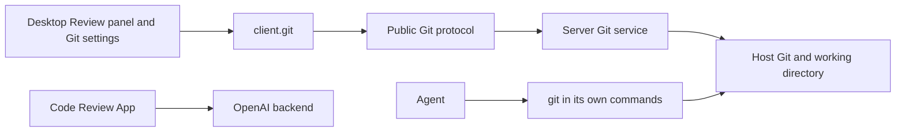

# Git

This document owns Cypheria's local Git experience: the Server's Git service and its protocol, the conversation header's branch controls, the Review panel, managed worktrees, and the Git and Worktrees settings. [Code Review](code-review.md) owns pull requests and merge requests, and [Plugins](../agents/plugins.md) owns plugin lifecycle details. Git commands act on the **Server host's working directory**; a connected GitHub or GitLab account is not required for local repository operations.

## Boundaries and data flow

`apps/server` owns Git execution, repository and worktree state, validation, and audit. `@cypheria/protocol` validates the public messages and `@cypheria/client` exposes them to Desktop. Electron main handles only OS-facing actions such as opening a local file or a URL. The renderer does not run Git. [Code Review](code-review.md) reads and writes existing pull requests and merge requests through OpenAI's backend; the Git service only creates one, at the end of the [Create PR workflow](#creating-pull-requests).

Local repository and managed-worktree capabilities are Agent-neutral and use Cypheria Thread IDs. A remote client may call a Server capability against that Server's host filesystem, but the Git design does not run a cloud checkout.

## Backend selection

| Operation | Selected backend and prerequisite |
| --- | --- |
| Repository, branch, Review, commit, push, and worktree operations | Host Git in the Server; an accessible local repository is required for operations other than availability and initialization. |
| Reading and reviewing GitHub pull requests and GitLab merge requests | [Code Review](code-review.md) through OpenAI's backend, with a ChatGPT sign-in and a GitHub or GitLab connection in ChatGPT. There is no `gh` or `glab` backend for them. |
| Creating a pull request or merge request | GitHub's `gh` CLI when it is installed and signed in for github.com; else the GitHub or GitLab account linked in ChatGPT, through Codex's `codex_apps` connector tools; else the provider's prefilled page in the browser. |

Local Git uses the `.git` repository and the host's Git installation and needs no hosting account. Pull request features need the ChatGPT prerequisites in [Code Review](code-review.md#prerequisites); without them those features stay unavailable and say so, and local Git keeps working.

## Protocol

The `git` capability provides local repository discovery and initialization, origin provider classification without exposing the remote URL, status, branch listing and context (current, upstream, default, ahead/behind), branch creation and checkout, diff, stage, unstage, commit, push, and managed worktree listing, creation, deletion, and restoration through the Server Git executor. Each `git.*.request` returns a correlated typed response with a success value or error. Git operations use the Server host's filesystem and Git installation. Managed worktrees live under `CYPHERIA_HOME/worktrees`; Server records their repository identity and uses `refs/cypheria/worktrees/*` to restore the committed HEAD after deletion. Listings include restorable deleted worktrees. Deletion rejects uncommitted changes and the current worktree.

The commit request accepts optional `includeUnstaged` and validated `coAuthors` fields. Including unstaged changes stages all local changes before the commit; an error after staging leaves the index available for recovery. Git process errors classify authentication, rejection, missing upstream, conflict, timeout, and nothing-to-commit cases.

The Server audits the start and outcome of mutating Git requests under their request ID. Audit records contain the operation type and outcome, without request payloads or repository paths. A mutation does not start when its initial audit write fails.

`git.branch-comparison.request` resolves a base and optional head ref to immutable commits, then returns their merge base, ahead/behind commit counts, and per-file line counts for changes from the merge base to the head. It rejects invalid or missing refs and leaves the working tree untouched.

`git.index-entries.request` returns the exact path's index mode, object ID, and conflict stage. `git.submodule-paths.request` lists stage-zero gitlinks from the index, including uninitialized submodules; neither operation opens submodule worktrees.

`git.text-blob.request` reads a file at a pinned commit as UTF-8 text, returning unavailable for non-blobs, binary data, or content over 1 MiB. `git.blame-file.request` returns bounded line attribution for a repository file without returning its contents. Both reject paths outside the repository. `git.review-file-contents.request` returns both complete sides of a Review file as UTF-8 text: the index against the working tree for unstaged changes, `HEAD` against the index or working tree for staged or uncommitted changes, and the pinned base and head revisions for branch, commit, and last-turn sources. A side where the file does not exist is null, and binary content or a side over 4 MiB makes the file unavailable. `git.generated-paths.request` returns the requested paths that the repository's attributes mark `linguist-generated`. `git.status.request` lists untracked files only up to 2,000; beyond that it leaves them out and reports their count in `untrackedOmitted`.

`git.index-info.request` returns the current worktree index modification time in milliseconds, or zero before an index exists, without exposing the index path. Clients can use it to detect index changes.

`git.worktree-job-start/read/cancel/retry` report a bounded in-memory creation state (`queued`, `creating`, `setting-up`, `ready`, `failed`, or `cancelled`) and setup output. Every managed worktree has a stable UUID used by Thread Attachments; unmanaged worktrees report no ID. Creation can copy staged, unstaged, and untracked changes when the selected start resolves to the source HEAD. A remote start attempts a best-effort upstream refresh when enabled. A selected environment config must be a regular JSON file inside the repository with `version: 1`, a nonempty `name`, and `setup.script` (optionally overridden by `setup.darwin.script` or `setup.linux.script`). Server copies that file into the worktree, stores its worktree-local path in Git config, and runs the script in the new worktree with `CODEX_SOURCE_TREE_PATH` and `CODEX_WORKTREE_PATH`. Setup failure preserves the worktree for retry or explicit skip; creation failure removes the newly allocated worktree.

`git.worktree-move-thread.request` can opt into copying local changes when the source and target HEAD match and the target is clean. `git.synced-branch-state/sync/undo` support guarded synchronization from a detached managed worktree to its selected local branch. Sync can include uncommitted worktree files through a temporary index and synthetic commit without changing the worktree index. It rejects dirty or externally moved branch checkouts, saves the old branch commit under `refs/cypheria/worktree-sync/*`, and updates the checkout and metadata; Undo requires the synchronized branch to remain unchanged. Setup captures only changes to a small allowlist of toolchain environment variables, writing `codex-shell-environment.json` in the worktree Git directory. Server passes the captured values to Codex thread start, resume, and fork through `shell_environment_policy.set` and retains them for restoration.

`git.availability`, `git.remotes`, `git.branch-exists`, and `git.branch-commits` expose bounded local queries; remote identities omit URL credentials. `git.apply-patch` supports staged, unstaged, and combined targets, reverse and binary patches, optional atomic checks, and three-way application with a temporary index for unstaged changes. `git.apply-changes` applies a source tree against a pinned destination HEAD after finding their merge base. Both return applied, skipped, and conflicted paths. `git.clone-state.request` reports shallow and partial clone state. `git.worktree-starting-ref.request` resolves a selected branch or revision to an immutable commit. The config read and write requests are limited to `codex.localEnvironmentConfigPath` in worktree-local Git config; reads return null before worktree config is enabled. `git.apply-review-sections.request` applies up to 100 revision-pinned Review actions in order and returns each action's applied, skipped, stale, conflict, or failed result, so callers can retain successful actions and refresh only failed sections. Server briefly caches repository discovery and invalidates it on Git mutations or filesystem watcher events. It broadcasts `git.repository-changed.notification` so Desktop refreshes Git and PR queries; periodic reads remain a fallback when native watching is unavailable.

`git.managed-worktrees.request` lists every managed worktree across repositories grouped by repository root, with each one's owner Thread and whether it is active, for the Worktrees settings page.

`git.pull-request-target.request` and `git.pull-request-create.request` run the [Create PR workflow](#creating-pull-requests): the first reports where a checkout's pull request would go and which sources can create it, and the second branches, commits, pushes, creates, and attaches it, failing with `GIT_PULL_REQUEST_FAILED` at the step that failed. Reading and reviewing pull requests are not part of the `git` capability.

## Conversation header

A Thread whose working directory is inside a repository shows its branch in the conversation header. The branch button opens a popover to commit (with a typed or generated message and an option to include unstaged changes), commit and push, or push; when the branch has a pull request, found through the Thread's attachments or through Code Review, the header shows its number and state with a menu that offers View PR in the Pull request panel, Open in GitHub or GitLab, Copy link, and Add to chat; otherwise Create PR fills the composer with a request to open one. The popover and the Review panel use the same Server Git API and commit code.

## Review panel

For a conversation with a local working directory, the Codex Review panel reads the repository through the Server Git API. It shows staged and unstaged files and text diffs plus committed branch changes from the merge base with the default branch. Branch diffs use a pinned HEAD and reject stale reads after HEAD moves. The panel offers repository initialization, branch creation and switching, file staging, unstaging, commit, push, and managed worktree creation, deletion, and restoration. Branch selection searches recent local and remote refs; selecting a remote ref creates a local tracking branch. Worktree deletion requires a clean worktree and saves its committed HEAD for restoration in the panel. The panel follows the thread working directory when available and refreshes local status while open.

The unstaged Review source also renders text diffs for untracked regular files before they are staged.

The Uncommitted source combines index and working tree changes against HEAD, including untracked files. In a repository without a first commit, it combines the staged and unstaged diffs.

The Commit source lists recent commits and compares a selected commit with its first parent, or with the empty tree for the root commit. File diffs use pinned commit hashes, so later working tree changes do not alter that review.

For local Codex turns, Server snapshots the repository's non-ignored files through a temporary Git index before and after the turn. It pins both trees under `refs/cypheria/turn-diffs` and stores the latest completed capture under `CYPHERIA_HOME/git-turn-diffs`. The Last turn source reads these trees, including untracked files, without changing the real index. Captures are best effort; a turn still runs if its Git snapshot fails.

Review shows changed files in the same file tree component as the workspace tree, with Git status colors, added and removed line counts, review-comment counts, and a filter. Beside it, or above it in a narrow panel, the selected file's diff uses the shared diff options and Viewed marks described below; stage, unstage, and revert actions for a text section sit at the start of that section. `::code-comment` findings in the Agent's replies also appear under their lines, labeled with the Agent's name, count toward the file tree's comments, and can be dismissed from the diff while they stay in the conversation. Pressing the add button beside a line, or after selecting a range on one side, writes a review comment; pending comments stay with the Thread until **Send to Agent** sends them as one message naming each file by absolute path and line or line range. Commit, branch, and worktree controls are collapsible sections below the diff. Review also offers path copying, inserting a path mention into the chat composer, **Open in tab** for the file's workspace tab, opening an existing repository file in the default application, and saving a copy. Electron main resolves the file and checks that it remains a regular file inside the discovered repository before opening or copying it. The commit controls can include unstaged changes, record co-authors, and commit then push; a failed push leaves the successful commit in place and can be retried separately.

All six Review sources support case-insensitive path filtering and an ignore-whitespace display option. Branch Review lets the user choose a local or remote base branch. Server provides per-file added and deleted line counts from Git's NUL-delimited numstat output; the panel shows counts for visible files and their total. The ignore-whitespace option also filters these counts. It hides section-level mutations because filtered hunks cannot safely identify raw patch sections; whole-file actions still use the unchanged file revision. Binary and untracked files omit line counts.

Review diffs render on the shared code viewer with syntax highlighting, word-level changes, per-file add and delete counts, and virtualized scrolling for large patches. A diff options menu chooses Auto, Split, or Unified layout (Auto splits wide views of files that both add and remove lines), word diffs, and wrapping, saved as Desktop client state; it also copies the patch as a `git apply` command. The menu can also hide hunks that only change top-level imports and hide generated files, meaning lock files, minified bundles, source maps, snapshots, and paths the repository attributes mark `linguist-generated`. Review loads full files through the Server for every source. When a working tree has more than 2,000 untracked files, Review shows tracked changes only and offers to copy an interactive `git clean` command. Jump to file searches the changed files. Each file header collapses the file and marks it Viewed; a viewed file collapses, shows a check in the file tree, and reads as unviewed again once its diff changes.

The Review panel remembers the most recently selected source in Desktop client state and falls back to unstaged changes when that source requires a thread that is not available. Pull requests can be attached to or detached from a chat through the shared Thread Attachment API. Desktop reads the Server-owned relationship, supports reverse lookup from a PR to linked chats, reacts to attachment notifications, and shows an attachment icon in the sidebar when the Git setting allows it. The same relationship is therefore visible to future Expo, Web, and CLI clients. Git settings remain in Server configuration. Server records the start and outcome of Git mutations in the shared audit log with the request ID; audit events omit paths, commit messages, and file contents.

## Review and mutation safety

Review combines staged, unstaged, uncommitted, branch, commit, and last-turn sources. The Server pins commit-based comparisons and gives mutable files a revision. Before a section action, it rereads the revision; stale actions fail and the panel refreshes. Patch application supports staged and unstaged targets, reverse and binary patches, optional atomic checking, and three-way application; batch results distinguish applied, skipped, conflicted, stale, and failed work. Revert creates a recoverable copy, and Undo rejects files changed since the revert.

Local Git writes run through the Server executor and audit boundary. A failed initial audit write prevents the mutation. A commit followed by a failed push leaves the commit available for a separate retry. Generated commit text uses the managed local Codex runtime and saved instructions. The explicit Generate controls produce editable drafts; an empty field can also trigger generation during submission.

Staged and unstaged Review files have a Server-issued revision. Whole-file and individual text-section stage or unstage actions refresh and compare that revision before changing the index; stale actions fail and refresh the Review. The unstaged source also supports confirmed whole-file and text-section revert. Before reverting, Server saves the original file or symlink under `CYPHERIA_HOME/git-review-undo`; the panel lists saved reverts after a restart and offers Undo. Undo rejects a file changed after revert. New, deleted, and binary files remain whole-file actions.

## Creating pull requests

Create PR in a conversation's header creates the pull request of the Thread's checkout, as ChatGPT Desktop's Create PR dialog does. It supports origins on github.com and gitlab.com. `git.pull-request-target` reports the origin repository, the current, upstream, and default branches, whether there are local changes, and the creation sources available, preferred first. `git.pull-request-create` then runs one audited workflow:

1. When the checkout is on its base branch, it switches to a new branch with the local changes.
2. When asked, it commits the local changes, writing a blank commit message from them.
3. It pushes the branch to `origin`, setting its upstream, unless the upstream already has every commit.
4. A blank title or description is written from the branch's changes; without a generated title, the last commit's subject or the branch name is used. A GitLab draft gets a `Draft:` prefix.
5. It creates the pull request through the first available source, or opens the provider's prefilled page when asked or when no other source exists.
6. It attaches the created pull request to the Thread with its Git root and branch.

Only one creation runs per repository at a time. A failed step stops the workflow and says what already happened, such as a commit whose push failed. A request to a linked account whose outcome is unknown is never retried; the user is asked to check the provider before trying again. When `gh` reports that the branch already has a pull request, that one is attached instead.

## Worktrees

Managed detached worktrees have a stable UUID, repository identity, an optional owning Cypheria Thread, setup metadata, and restorable Git refs. Creation and thread handoff can copy local changes under guarded conditions. Worktree handoff uses the common Thread working-directory capability rather than a Codex identity, so every Agent adapter can participate when it supports changing `cwd`. Branch synchronization can include uncommitted changes by creating a synthetic snapshot through a temporary index; it checks the branch baseline and source checkout, retains a backup ref, and supports Undo. Setup may capture an allowlisted toolchain environment for later Agent startup where the adapter supports it. Archiving a worktree stores a commit of its working state under the snapshot ref, built through a temporary index so local changes and non-ignored untracked files are included, and restoring recreates the checkout from that commit; submodules and embedded repositories refuse the archive. Retention cleanup protects active use and dirty worktrees; an archived thread's cleaned worktree is restored before unarchiving.

Managed worktrees persist an optional owner Thread ID in Cypheria's worktree metadata. The Server checks that an assigned local Codex thread belongs to the same repository and currently uses that worktree. A worktree with an owner cannot be deleted until its owner moves away.

The Review panel can move an idle local Thread between its checkout and an active managed worktree. The Server rejects a move during a turn or pending interaction, asks the selected Agent adapter to change the working directory, updates worktree ownership and its Thread Attachment, and restores the prior directory if the move fails. The common path supports every Agent adapter that implements working-directory changes. The move can optionally copy local changes when both checkouts have the same HEAD and the destination is clean; the source files remain available.
When the thread starts in a repository subdirectory, the Server moves it to the same relative directory in the target worktree. It rejects missing directories and paths that resolve outside the target worktree.

The Review panel can create a detached managed worktree from `HEAD` or a selected local or remote branch. The source checkout stays on its current branch.

When creating it, Server copies ignored `AGENTS.override.md` files and ignored regular files selected by the source root's `.worktreeinclude`. It skips symlinks and existing destination files.

The Worktrees controls can include local changes and select a repository-local environment config. Creation progress, setup output, cancellation, retry, and skip-setup are shown in the Review panel. With no selected environment, setup is skipped.

For a local branch selected from a different checkout branch, the managed detached worktree records a synced-branch baseline. Review can sync committed and uncommitted worktree changes to that branch while the source checkout is clean and the branch still points to its recorded baseline. Server snapshots uncommitted changes through a temporary index, stores the previous branch commit under `refs/cypheria/worktree-sync/*`, and offers Undo. Thread moves can optionally copy staged, unstaged, and untracked regular files when both worktrees share the same HEAD and the target is clean; the source keeps its files for recovery. A setup script's safe toolchain environment changes are captured in the worktree Git directory and retained in managed metadata for restoration.

After creating a managed worktree, Server may clean up at most five older managed worktrees according to the retention setting. It protects the source checkout, the new worktree, worktrees used by active or unarchived threads, dirty worktrees, and worktrees created or updated in the last ten minutes. Archive and thread handoff also trigger cleanup; an archived thread's snapshot is restored before unarchiving when needed. Cleaned worktrees retain a Git snapshot and can be restored. A cleanup failure does not undo successful worktree creation.

## Settings

Git, Worktrees, and Code Review settings follow the official desktop's pages and store their values in Server configuration.

- **Git** covers Git-based diffs (the last-turn-only review mode), branch prefix, merge method, guarded force push, draft pull requests (the Create PR dialog's default), Watch and fix (auto-merge and watch instructions), and commit and pull request instructions. Instructions save on their own after a pause.
- **Worktrees** covers the worktree root, which takes effect after Server restart, the upstream refresh before each new worktree, and automatic deletion with its limit; turning deletion off asks for confirmation. Below them it lists the managed worktrees by repository with their linked conversations, opens a new chat in a worktree, and deletes a worktree once no chat uses it.
- **Code Review** hosts the Code Review App's settings; see [Code Review](code-review.md#desktop-surfaces).

For new or resumed managed Codex threads, Server includes the configured branch prefix and commit and PR instructions in Codex developer instructions.

## Persisted state

| State | Owner and lifetime |
| --- | --- |
| Git and Code Review preferences and text instructions | Server configuration; shared across Desktop sessions. The configured worktree root takes effect after Server restart. |
| Thread identity, working directory, and Git attachments | Server persistence. `thread_attachments` records cross-client PR and worktree relationships; managed worktree metadata also enforces host lifecycle invariants. |
| Worktree snapshots and synchronization backups | Managed metadata and `refs/cypheria/*` in Git; retained for restoration and guarded Undo. |
| Last-turn trees and Review revert copies | Server runtime data under `CYPHERIA_HOME`; retained across process restarts as described in [Review panel](#review-panel). |
| Selected Review source | Desktop client state; it is presentation-only and may differ by client. |
| Workspace threads and Code Review pinned and recent pull requests | Server persistence in `workspace_threads` and `code_review_prs`, shared by every client. |
| Collapsed Code Review sidebar sections | Desktop client state. |
| Repository discovery cache and filesystem watchers | Server memory only. Mutations and watcher events invalidate discovery and notify Desktop; periodic reads cover unsupported watching. |
| GitHub and GitLab connections | ChatGPT account state, read through OpenAI's backend; see [Code Review](code-review.md). |

## Agent tools and validation status

The public Git and Thread Attachment contracts are independent of an Agent harness. Agents do not receive the Git protocol as tools: they run `git` and `gh` themselves, attach pull requests and manage worktrees through the [Cypheria app tools](../agents/plugins.md#cypheria-app-tools), and read pull request checks through the bundled `code-review` plugin. Other Agent adapters (Pi, OpenCode, and ACP) have an implementation point at the same public service boundary and do not need a second Git store or attachment model.

Local protocol, Git, worktree, and UI checks cover the implemented paths. Live Code Review calls with a real ChatGPT account remain the explicit [verification task](../roadmap.md#local-git-and-pull-requests); completion of those checks is required before claiming end-to-end parity.
