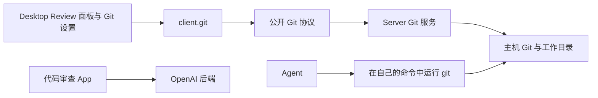

# Git

本文负责 Cypheria 的本地 Git 体验：Server 的 Git 服务及其协议、会话标题栏的分支控件、Review 面板、托管工作树，以及 Git 和工作树设置。[代码审查](code-review.zh-CN.md)负责 Pull Request 和合并请求，[插件](../agents/plugins.zh-CN.md)负责插件生命周期。Git 命令作用于 **Server 主机的工作目录**；本地仓库操作不要求连接 GitHub 或 GitLab 账户。

## 边界与数据流

`apps/server` 负责 Git 执行、仓库和工作树状态、校验及审计。`@cypheria/protocol` 校验公开消息，`@cypheria/client` 将能力提供给 Desktop。Electron main 只处理打开本地文件或 URL 等操作系统动作。renderer 不运行 Git。[代码审查](code-review.zh-CN.md)通过 OpenAI 后端读写已有的 Pull Request 和合并请求；Git 服务只在[创建 PR 流程](#创建拉取请求)的最后创建它们。

本地仓库与托管工作树能力不依赖具体 Agent，并统一使用 Cypheria Thread ID。远程客户端可以调用 Server 能力，操作的是该 Server 主机的文件系统；此设计不运行云端 checkout。

## 后端选择

| 操作 | 选用的后端与条件 |
| --- | --- |
| 仓库、分支、Review、提交、推送和工作树操作 | Server 内的主机 Git；除可用性检查和初始化外，操作需要可访问的本地仓库。 |
| 读取和审查 GitHub Pull Request 与 GitLab 合并请求 | 通过 OpenAI 后端的[代码审查](code-review.zh-CN.md)，需要 ChatGPT 登录以及在 ChatGPT 中连接 GitHub 或 GitLab。它们没有 `gh` 或 `glab` 后端。 |
| 创建 Pull Request 或合并请求 | 已安装并登录 github.com 的 GitHub `gh` CLI；否则通过 Codex 的 `codex_apps` connector 工具，使用在 ChatGPT 中关联的 GitHub 或 GitLab 账户；否则在浏览器中打开提供方的预填页面。 |

本地 Git 使用 `.git` 仓库和主机 Git 安装，不需要托管平台账户。Pull Request 功能需要[代码审查](code-review.zh-CN.md#前提条件)中的 ChatGPT 前提条件；缺少时这些功能保持不可用并说明原因，本地 Git 照常工作。

## 协议

`git` capability 通过 Server Git 执行器提供本地仓库发现与初始化、不暴露远程 URL 的 origin provider 分类、状态、分支列表与上下文（当前、上游、默认、领先/落后提交数）、分支创建与切换、差异、暂存、取消暂存、提交、推送，以及托管 worktree 的列举、创建、删除和恢复。每个 `git.*.request` 都返回带关联 ID 的类型化成功值或错误。Git 操作使用 Server 所在主机的文件系统和 Git 安装。托管 worktree 位于 `CYPHERIA_HOME/worktrees` 下；Server 记录其仓库身份，并通过 `refs/cypheria/worktrees/*` 在删除后恢复已提交的 HEAD。列表包括可恢复的已删除 worktree。存在未提交改动时或目标为当前工作树时拒绝删除。

提交请求可选带 `includeUnstaged` 和经过校验的 `coAuthors` 字段。纳入未暂存改动时会先暂存全部本地改动；若暂存后发生错误，index 会保留以供恢复。Git 进程错误区分认证、拒绝、缺少上游、冲突、超时及无可提交内容。

Server 以请求 ID 关联并审计 Git 修改请求的开始和结果。审计记录只包含操作类型和结果，不包含请求载荷或仓库路径。开始阶段的审计写入失败时，不执行修改。

`git.branch-comparison.request` 将 base 和可选的 head ref 解析为固定提交，返回两者的 merge base、领先/落后提交数，以及从 merge base 到 head 的逐文件增删行数。无效或不存在的 ref 会被拒绝，工作树不会被改动。

`git.index-entries.request` 返回指定路径的索引 mode、对象 ID 和冲突 stage。`git.submodule-paths.request` 从索引列出 stage 为零的 gitlink，包括尚未初始化的 submodule；两者都不会打开 submodule 工作树。

`git.text-blob.request` 将固定提交中的文件读取为 UTF-8 文本；非 blob、二进制数据及超过 1 MiB 的内容返回不可用。`git.blame-file.request` 返回仓库文件有上限的逐行归属信息，不返回文件内容。两者都拒绝仓库外路径。`git.review-file-contents.request` 以 UTF-8 文本返回 Review 文件两侧的完整内容：未暂存变更为索引对工作树，已暂存或未提交变更为 `HEAD` 对索引或工作树，branch、commit 和 last-turn 来源为固定的 base 与 head 修订。文件在某一侧不存在时该侧为 null；二进制内容或任一侧超过 4 MiB 时返回不可用。`git.generated-paths.request` 返回请求路径中被仓库 attributes 标记为 `linguist-generated` 的路径。`git.status.request` 最多列出 2,000 个未跟踪文件；超出时不列出它们，并在 `untrackedOmitted` 中报告数量。

`git.index-info.request` 返回当前工作树索引的毫秒修改时间；索引尚不存在时返回零，且不暴露索引路径。客户端可用它检测索引变化。

`git.worktree-job-start/read/cancel/retry` 返回有界的内存中创建状态（`queued`、`creating`、`setting-up`、`ready`、`failed` 或 `cancelled`）及 setup 输出。每个托管 worktree 都有一个供 Thread Attachments 使用的稳定 UUID；非托管 worktree 不提供 ID。选定起点解析为源 HEAD 时，创建可复制已暂存、未暂存和未跟踪改动；远端起点在启用时会 best-effort 刷新上游。选定的环境配置须为仓库内的普通 JSON 文件，包含 `version: 1`、非空 `name` 和 `setup.script`，可用 `setup.darwin.script` 或 `setup.linux.script` 覆盖。Server 将文件复制到工作树，把工作树内路径写入专属 Git config，并在新工作树中运行脚本，注入 `CODEX_SOURCE_TREE_PATH` 和 `CODEX_WORKTREE_PATH`。setup 失败会保留工作树供重试或明确跳过；创建失败会清理新分配的工作树。

`git.worktree-move-thread.request` 可选择在源与目标 HEAD 相同且目标干净时复制本地改动。`git.synced-branch-state/sync/undo` 支持将托管 detached worktree 的变更受保护地同步到选定的本地分支。同步可通过临时 index 和合成提交纳入未提交文件，且不改变工作树 index；它会拒绝脏的源 checkout 或已在外部移动的分支，先前的分支提交保存在 `refs/cypheria/worktree-sync/*`，并更新 checkout 与元数据。撤销要求同步后的分支未再次变化。setup 只捕获少量白名单工具链环境变量的变化，将 `codex-shell-environment.json` 写入 worktree Git 目录；Server 在 Codex 线程启动、恢复和 fork 时通过 `shell_environment_policy.set` 传入捕获值，并保留这些值供恢复。

`git.availability`、`git.remotes`、`git.branch-exists` 和 `git.branch-commits` 提供有界的本地查询；远端身份不包含 URL 凭据。`git.apply-patch` 支持暂存、未暂存及组合目标、反向与二进制补丁、可选原子检查，以及使用临时 index 的未暂存三方应用。`git.apply-changes` 在找到 merge base 后，将源 tree 应用到固定的目标 HEAD。两者返回已应用、跳过及冲突的路径。`git.clone-state.request` 返回浅克隆与部分克隆状态。`git.worktree-starting-ref.request` 将选定分支或修订解析为固定提交。Git config 读写请求只允许操作工作树专属配置中的 `codex.localEnvironmentConfigPath`；启用工作树配置前，读取返回 null。`git.apply-review-sections.request` 按顺序执行最多 100 个固定文件修订的 Review 操作，逐项返回已应用、跳过、过期、冲突或失败结果，调用方可保留成功项并只刷新失败项。Server 短暂缓存仓库发现，并在 Git 修改或文件系统监视事件发生时失效。它广播 `git.repository-changed.notification`，让 Desktop 刷新 Git 和 PR 查询；不支持原生监视时，定期读取仍可作为后备。

`git.managed-worktrees.request` 按仓库根目录分组列出所有托管工作树，以及每个工作树的所属 Thread 和是否活跃，供工作树设置页使用。

`git.pull-request-target.request` 和 `git.pull-request-create.request` 执行[创建 PR 流程](#创建拉取请求)：前者报告检出的拉取请求会去往哪里、哪些来源可以创建它；后者创建分支、提交、推送、创建并附加它，在失败的那一步以 `GIT_PULL_REQUEST_FAILED` 失败。读取和审查拉取请求不属于 `git` 能力。

## 会话标题栏

工作目录位于仓库内的 Thread 会在会话标题栏显示其分支。分支按钮打开一个弹层，可提交（使用手写或自动生成的提交信息，并可选择包含未暂存变更）、提交并推送，或仅推送；当分支有拉取请求（通过 Thread 附件或代码审查找到）时，标题栏显示其编号和状态，菜单提供在 Pull Request 面板中查看 PR、在 GitHub 或 GitLab 中打开、复制链接和添加到聊天；否则“创建 PR”会在编辑器中填入创建请求。弹层与 Review 面板使用同一套 Server Git API 和提交代码。

## Review 面板

对于有本地工作目录的会话，Codex 的 Review 面板通过 Server Git API 读取仓库。它展示已暂存及未暂存的文件和文本差异，以及从默认分支的共同祖先算起的已提交分支变更。分支差异固定 HEAD 快照，HEAD 变化后会拒绝读取过期差异。面板提供仓库初始化、分支创建与切换、文件暂存、取消暂存、提交、推送，以及托管工作树的创建、删除和恢复操作。分支选择可检索最近的本地及远端引用；选择远端引用会创建本地跟踪分支。删除工作树要求其没有未提交改动，并保存已提交的 HEAD，供在面板中恢复。面板优先使用会话工作目录，并在打开时刷新本地状态。

Review 的未暂存来源也会在文件暂存前展示未跟踪普通文件的文本差异。

“未提交”来源相对 HEAD 合并展示 index 与工作目录的更改，包括未跟踪文件。仓库尚无第一次提交时，则组合已暂存与未暂存差异。

“提交”来源列出最近的提交，将选定提交与第一个父提交比较；根提交则与空树比较。文件差异使用固定的提交哈希，之后的工作目录变化不会改变该 Review。

对于本地 Codex 轮次，Server 在轮次前后通过临时 Git index 保存仓库中未被忽略的文件快照。两个 tree 固定在 `refs/cypheria/turn-diffs` 下，最近完成的捕获记录保存在 `CYPHERIA_HOME/git-turn-diffs`。“最后一轮”来源从这两个 tree 读取差异，包含未跟踪文件，且不会修改真实 index。快照以尽力而为方式执行；Git 快照失败不会阻止轮次运行。

Review 用与工作区文件树相同的文件树组件展示变更文件，带 Git 状态颜色、增删行数、评审评论数和筛选框。所选文件的 diff 位于其旁（窄面板中位于其上），使用下文所述的共享差异选项和“已查看”标记；文本段的暂存、取消暂存和还原操作位于该段开头。Agent 回复中的 `::code-comment` 发现也会显示在对应行之下，标明 Agent 名称，并计入文件树的评论数；可将其从 diff 中隐藏，但仍保留在对话中。点击行旁的添加按钮（或先在同一侧选中多行）即可写评审评论；待发送的评论随 Thread 保存，点击**发送给 Agent**后作为一条消息发出，消息用绝对路径和行号或行范围标明每个位置。提交、分支和工作树控件是 diff 下方可折叠的分区。Review 按目录组织变更文件，并可复制路径、将路径引用插入聊天输入框、通过**在标签页中打开**打开该文件的工作区标签页、用默认应用打开仓库中现有的文件，或另存副本。Electron main 在打开或复制前解析文件，并确认它仍是已发现仓库内的常规文件。提交控件可纳入未暂存的变更、记录共同作者，并支持提交后推送；推送失败时已成功的提交会保留，可单独重试推送。

Review 的六种来源都支持不区分大小写的路径筛选和忽略空白变更的显示选项。分支 Review 可选择本地或远端基准分支。Server 从 Git 的 NUL 分隔 numstat 输出提供逐文件增删行数；面板显示可见文件的计数及合计。忽略空白选项也会过滤这些计数。由于过滤后的段落不能安全地定位原始补丁段落，该模式隐藏段落级修改；整文件操作仍使用未改变的文件 revision。二进制及未跟踪文件不显示行数。

Review diff 使用共享代码查看器渲染，带语法高亮、词级差异、按文件的增删统计，并对大补丁做虚拟化滚动。差异选项菜单可选择“自动”“并排”或“统一”布局（“自动”在视图足够宽且文件同时有增删时并排显示）、词级差异和自动换行，并保存为 Desktop 客户端状态；它还能把补丁复制为 `git apply` 命令。菜单还可隐藏只改动顶层 import 的 hunk，以及隐藏生成的文件，即锁文件、压缩包、source map、快照，以及仓库 attributes 标记为 `linguist-generated` 的路径。Review 对所有来源都可通过 Server 加载完整文件。工作树中未跟踪文件超过 2,000 个时，Review 只显示已跟踪的变更，并可复制交互式 `git clean` 命令。“跳转到文件”可搜索变更文件。每个文件标题可折叠该文件并标记为“已查看”；已查看的文件会折叠、在文件树中显示勾号，其 diff 变化后会重新视为未查看。

Review 面板在 Desktop 客户端状态中记住最近选择的来源；若该来源需要当前不存在的线程，则回退到未暂存改动。Pull request 通过共享 Thread Attachment API 附加到聊天或解除附加。Desktop 读取 Server 权威关系，支持从 PR 反查关联聊天，响应附件通知，并在 Git 设置允许时于侧边栏显示附加图标；未来的 Expo、Web 与 CLI 客户端因此能看到同一关系。Git 设置仍保存在 Server 配置中。Server 在共享审计日志中记录 Git 修改操作的开始及结果，并关联请求 ID；审计事件不包含路径、提交消息或文件内容。

## Review 与修改安全

Review 汇集已暂存、未暂存、未提交、分支、提交及最后一轮来源。Server 固定基于提交的比较，并为可变文件提供 revision。执行段落操作前重新读取 revision；过期操作失败并刷新面板。补丁应用支持暂存与未暂存目标、反向与二进制补丁、可选原子检查和三方应用；批量结果区分已应用、跳过、冲突、过期和失败。撤销改动前会保存可恢复副本；文件在撤销后再次变化时，Undo 会拒绝恢复。

本地 Git 写入经过 Server 执行器与审计边界。初始审计写入失败会阻止操作。提交成功后若推送失败，提交仍可单独重试推送。提交文案通过受管本地 Codex runtime 及保存的指令生成。显式“生成”操作会产生可编辑草稿；提交时字段为空也可触发生成。

Review 的已暂存和未暂存文件由 Server 提供 revision。整文件或单个文本段落的暂存、取消暂存操作会在修改 index 前重新核对 revision；过期操作会失败并刷新 Review。未暂存来源还支持经确认后撤销整文件或单个文本段落的更改。撤销前 Server 将原文件或符号链接保存在 `CYPHERIA_HOME/git-review-undo`，面板在重启后仍列出已保存的撤销记录并提供恢复操作；撤销后文件再次变化时会拒绝恢复。新增、删除及二进制文件仍以整文件操作。

## 创建拉取请求

对话标题中的创建 PR 会为 Thread 的检出创建 Pull Request，与 ChatGPT Desktop 的创建 PR 对话框相同。它支持位于 github.com 和 gitlab.com 的 origin。`git.pull-request-target` 报告 origin 仓库、当前分支、上游分支和默认分支、是否有本地更改，以及可用的创建来源（首选的排在前面）。随后 `git.pull-request-create` 执行一个经过审计的流程：

1. 检出位于其基础分支时，带着本地更改切换到新分支。
2. 需要时提交本地更改；提交信息为空时根据这些更改生成。
3. 把分支推送到 `origin` 并设置上游，除非上游已经包含所有提交。
4. 标题或描述为空时根据分支的更改生成；没有生成标题时，使用最后一个提交的标题或分支名。GitLab 草稿会加上 `Draft:` 前缀。
5. 通过第一个可用来源创建 Pull Request；被要求时，或没有其他来源时，打开提供方的预填页面。
6. 把创建的 Pull Request 连同其 Git 根目录和分支附加到 Thread。

同一个仓库同时只运行一个创建流程。某一步失败会停止流程，并说明已经完成了什么，例如提交成功但推送失败。向关联账户发出、结果未知的请求绝不会重试；会请用户先到提供方确认再重试。`gh` 报告分支已有 Pull Request 时，改为附加那一个。

## 工作树

托管的 detached 工作树保存稳定 UUID、仓库身份、可选的所属 Cypheria 线程、setup 元数据及可恢复 Git ref。创建和线程迁移可在受保护的条件下复制本地改动。工作树迁移使用公共 Thread 工作目录能力而非 Codex 身份，因此每个支持修改 `cwd` 的 Agent adapter 都能参与。分支同步可通过临时索引创建合成快照，纳入未提交变更；同步校验分支基线和源 checkout，保留备份 ref，并支持 Undo。setup 可以捕获白名单内的工具链环境变量，供支持该能力的 Agent adapter 后续启动使用。归档工作树时，会通过临时索引把其工作状态保存为快照 ref 下的一个提交，因此本地变更和未忽略的未跟踪文件都包含在内，恢复时从该提交重建检出目录；含 submodule 或嵌套仓库的工作树会拒绝归档。保留数量清理会保护正在使用及含未提交改动的工作树；已归档线程被清理的工作树会在取消归档前恢复。

托管工作树可在 Cypheria 的工作树元数据中持久记录所属线程 ID。Server 在关联本地 Codex 线程时，会核对同一仓库及线程当前使用的工作树；有归属线程的工作树必须在线程迁走后才能删除。

Review 面板可将空闲的本地 Thread 在检出目录与活跃托管工作树之间移动。Server 会拒绝在轮次运行中或存在待处理交互时移动，要求所选 Agent adapter 修改工作目录，更新工作树归属及其 Thread Attachment；移动失败时恢复原工作目录。公共路径支持所有实现工作目录变更的 Agent adapter。两个检出目录的 HEAD 相同且目标干净时，移动可选择复制本地改动；源目录中的文件仍会保留。
线程从仓库子目录出发时，Server 会将它移到目标工作树中的相同相对目录。目标目录不存在或解析到工作树之外时，移动会被拒绝。

Review 面板可从 `HEAD` 或选定的本地、远端分支创建分离状态的托管工作树；源检出目录保持在原分支。

创建时，Server 会复制被忽略的 `AGENTS.override.md` 文件，以及源仓库根目录的 `.worktreeinclude` 所选中的被忽略普通文件；跳过符号链接和目标中已有的文件。

Review 面板的工作树控件可选择包含本地改动及仓库内环境配置，并展示创建进度、setup 输出、取消、重试和跳过 setup。未选择环境时跳过 setup。

若从不同于当前 checkout 分支的本地分支创建托管的 detached worktree，它会记录同步分支的基线。源 checkout 干净且目标分支仍指向已记录的基线时，Review 可将 worktree 中已提交和未提交的变更同步到该分支。Server 通过临时索引为未提交变更创建快照，将先前的分支提交保存在 `refs/cypheria/worktree-sync/*`，并提供撤销。若两个工作树的 HEAD 相同且目标干净，线程迁移可选择复制已暂存、未暂存及未跟踪的常规文件；源目录保留文件以便恢复。setup 脚本对安全工具链环境变量的更改会捕获到 worktree Git 目录，并保存在托管元数据中供恢复。

创建托管工作树后，Server 可按保留数量设置清理最多五个较旧的托管工作树。它会保护源 checkout、新建工作树、活跃或未归档线程使用的工作树、含未提交改动的工作树，以及最近十分钟创建或更新的工作树。归档和线程迁移也会触发清理；必要时会先从快照恢复已归档线程的工作树再取消归档。被清理的工作树仍保留 Git 快照，可恢复。清理失败不会撤销成功的工作树创建。

## 设置

Git、工作树和代码审查设置沿用官方桌面端的页面，并将其值保存在 Server 配置中。

- **Git** 包括基于 Git 的 diff（仅最后一轮的审查模式）、分支前缀、合并方式、带租约的强制推送、草稿拉取请求（Create PR 对话框的默认值）、监控并修复（自动合并与监控说明），以及提交和拉取请求说明。说明在停顿后自动保存。
- **工作树** 包括工作树根目录（Server 重启后生效）、每个新工作树创建前的上游刷新，以及自动删除及其上限；关闭自动删除需要确认。其下按仓库列出托管工作树及其关联的对话，可在某个工作树中新建聊天，并在没有聊天使用时删除工作树。
- **代码审查** 承载代码审查 App 的设置；见[代码审查](code-review.zh-CN.md#desktop-界面)。

对于新建或恢复的托管 Codex 线程，Server 会将配置的分支前缀和提交、PR 指令写入 Codex developer instructions。

## 持久状态

| 状态 | 所属位置与生命周期 |
| --- | --- |
| Git 与代码审查偏好及文案指令 | Server 配置，跨 Desktop 会话共享。配置的工作树根目录在 Server 重启后生效。 |
| 线程身份、工作目录与 Git 附件 | Server 持久状态。`thread_attachments` 保存跨客户端 PR/工作树关系；托管工作树元数据同时执行主机生命周期约束。 |
| 工作树快照与同步备份 | 托管元数据及 Git 中的 `refs/cypheria/*`，用于恢复和受保护的 Undo。 |
| 最后一轮 tree 与 Review 撤销副本 | `CYPHERIA_HOME` 下的 Server 运行数据；跨进程重启保留，详见 [Review 面板](#review-面板)。 |
| 选定的 Review 来源 | Desktop 客户端状态；只影响展示，不要求各客户端一致。 |
| 工作区 Thread 与代码审查已固定和最近的 Pull Request | Server 持久状态 `workspace_threads` 和 `code_review_prs`，所有客户端共享。 |
| 折叠的代码审查侧边栏分区 | Desktop 客户端状态。 |
| 仓库发现缓存与文件系统监视器 | 只存在于 Server 内存。修改和监视事件会使发现结果失效并通知 Desktop；不支持监视时仍有定期读取。 |
| GitHub 与 GitLab 连接 | ChatGPT 账户状态，通过 OpenAI 后端读取；见[代码审查](code-review.zh-CN.md)。 |

## Agent 工具与验证状态

公开 Git 与 Thread Attachment 契约不依赖具体 Agent harness。Agent 不会以工具形式获得 Git 协议：它们自己运行 `git` 和 `gh`，通过 [Cypheria app tools](../agents/plugins.zh-CN.md#cypheria-app-tools) 附加拉取请求、管理 worktree，并通过随附的 `code-review` 插件读取拉取请求的检查。其他 Agent adapter（Pi、OpenCode 和 ACP）在同一个公开 service 边界拥有实现位置，无需建立第二套 Git 存储或附件模型。

本地协议、Git、工作树及 UI 检查覆盖了已实现路径。使用真实 ChatGPT 账户的代码审查实时调用仍属于明确的[验收任务](../roadmap.zh-CN.md#本地-git-与拉取请求)；完成这些检查后才能宣称端到端对齐。
