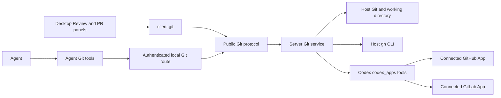

# Local Git design

This document explains how Cypheria's local Git experience is assembled and why each backend is selected. [Desktop](desktop.md) owns the visible Review and PR/MR behavior, [Protocol](protocol.md) owns request contracts, and [Integrations](integrations.md) owns plugin and App lifecycle details. Git commands act on the **Server host's working directory**; a connected GitHub or GitLab account is not required for local repository operations.

## Boundaries and data flow

`apps/server` owns Git execution, repository and worktree state, connector calls, validation, and audit. `@cypheria/protocol` validates the public messages and `@cypheria/client` exposes them to Desktop. Electron main handles only OS-facing actions such as opening a local file or a URL. The renderer does not run Git, `gh`, or connector tools. The bundled Agent plugin calls the same Server capability; it is a Codex MCP client, not an implementation of the GitHub or GitLab App.

Local repository and managed-worktree capabilities are Agent-neutral and use Cypheria Thread IDs. A remote client may call a Server capability against that Server's host filesystem, but the Git design does not run a cloud checkout. Connector operations implemented through `codex_apps` remain a Codex extension until another Agent adapter provides an equivalent connector backend.

## Backend selection

| Operation | Selected backend and prerequisite |
| --- | --- |
| Repository, branch, Review, commit, push, and worktree operations | Host Git in the Server; an accessible local repository is required for operations other than availability and initialization. |
| GitHub PR read, diff, checks, discussion, create, and writes | Desktop prefers an installed, authenticated `gh` with access to the current repository. Selection is made per operation. |
| GitHub PR read or create when the CLI path cannot serve the operation | A local Codex thread, enabled GitHub connector fallback, repository access, and that operation's `codex_apps` tool group on one account link are required. App capability is reported separately for list, account search, detail, diff, activity, checks, threads, media, and create. Other PR writes require `gh`. |
| GitHub PR board across repositories | Authenticated host `gh` search; it uses the account's accessible repositories, with state, involvement, text, and repository filters. |
| GitLab MR native reads and writes | The connected GitLab App's `codex_apps` tools for a local Codex thread. Each action needs its own tool group, project access, and one account link. There is no `glab` backend. |
| GitLab MR prefilled browser form | Host Git verifies the pushed branch and Desktop opens GitLab.com in the system browser; this path does not require a connector write tool. |

Installing a GitHub or GitLab plugin makes its declared App available to Codex, but installation, account authorization, tool discovery, and repository access are separate states. Local Git uses the `.git` repository and the host's Git installation. `gh` uses its own active CLI account. App calls use the connector link selected through Codex; Cypheria does not treat a plugin display name as an account or hold connector credentials. If neither backend can serve an operation, that operation stays unavailable and its error is shown rather than silently changing authentication paths.

GitHub provider selection is explicit in Desktop: the usable CLI wins; otherwise the enabled App path is considered only for its reported operation capability and a local thread. GitLab has no CLI fallback for native MR operations. Server checks the repository origin, connector, account link, tool scope, project, resource URI, and returned URLs before using App data. Details of the App model and external browser connection flow are in [Integrations](integrations.md).

## Review and mutation safety

Review combines staged, unstaged, uncommitted, branch, commit, and last-turn sources. The Server pins commit-based comparisons and gives mutable files a revision. Before a section action, it rereads the revision; stale actions fail and the panel refreshes. Patch application supports staged and unstaged targets, reverse and binary patches, optional atomic checking, and three-way application; batch results distinguish applied, skipped, conflicted, stale, and failed work. Revert creates a recoverable copy, and Undo rejects files changed since the revert.

Local Git writes run through the Server executor and audit boundary. A failed initial audit write prevents the mutation. Writes to an existing PR compare the displayed head commit with the current PR head; connector calls verify their selected account and resource again. A commit followed by a failed push leaves the commit available for a separate retry. Uncertain PR creation causes a readback or a check-on-GitHub prompt before another creation attempt. Generated commit and PR text uses the managed local Codex runtime and saved instructions. The explicit Generate controls produce editable drafts; an empty field can also trigger generation during submission.

## Worktrees and persisted state

Managed detached worktrees have a stable UUID, repository identity, an optional owning Cypheria Thread, setup metadata, and restorable Git refs. Creation and thread handoff can copy local changes under guarded conditions. Worktree handoff uses the common Thread working-directory capability rather than a Codex identity, so every Agent adapter can participate when it supports changing `cwd`. Branch synchronization can include uncommitted changes by creating a synthetic snapshot through a temporary index; it checks the branch baseline and source checkout, retains a backup ref, and supports Undo. Setup may capture an allowlisted toolchain environment for later Agent startup where the adapter supports it. Retention cleanup protects active use and dirty worktrees; an archived thread's cleaned worktree is restored before unarchiving.

| State | Owner and lifetime |
| --- | --- |
| Git preferences and text instructions | Server configuration; shared across Desktop sessions. The configured worktree root takes effect after Server restart. |
| Thread identity, working directory, and Git attachments | Server persistence. `thread_attachments` records cross-client PR and worktree relationships; managed worktree metadata also enforces host lifecycle invariants. |
| Worktree snapshots and synchronization backups | Managed metadata and `refs/cypheria/*` in Git; retained for restoration and guarded Undo. |
| Last-turn trees and Review revert copies | Server runtime data under `CYPHERIA_HOME`; retained across process restarts as described in [Desktop](desktop.md). |
| Selected Review source | Desktop client state; it is presentation-only and may differ by client. |
| Repository discovery cache and filesystem watchers | Server memory only. Mutations and watcher events invalidate discovery and notify Desktop; periodic reads cover unsupported watching. |
| GitHub/GitLab App connection | Codex connector account state; Cypheria checks current tool and link availability before each supported action. |

## Agent tools and validation status

The public Git and Thread Attachment contracts are independent of an Agent harness. The `cypheria-bundled` marketplace currently distributes `cypheria-app-tools` to Cypheria's managed Codex home, so Codex is the first Agent with the complete tool path. Its tools use the authenticated public Git route and the same Server policies as Desktop. Other Agent adapters have an implementation point at the same public service boundary and do not need a second Git store or attachment model.

Local protocol, Git, worktree, provider-selection, and UI checks cover the implemented paths. Packaged Electron Connect behavior and live GitHub/GitLab authorization and PR/MR calls in Cypheria's managed Codex home remain the explicit [verification task](todo.md#local-git-and-pull-requests); completion of those checks is required before claiming end-to-end parity.
