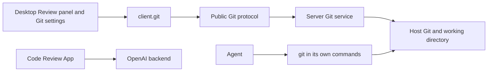

# Local Git design

This document explains how Cypheria's local Git experience is assembled and why each backend is selected. [Desktop](desktop.md) owns the visible Review behavior, [Code Review](code-review.md) owns pull requests and merge requests, [Protocol](protocol.md) owns request contracts, and [Integrations](integrations.md) owns plugin lifecycle details. Git commands act on the **Server host's working directory**; a connected GitHub or GitLab account is not required for local repository operations.

## Boundaries and data flow

```mermaid
flowchart LR
  Desktop[Desktop Review panel and Git settings] --> Client[client.git]
  Client --> Protocol[Public Git protocol]
  Protocol --> Server[Server Git service]
  Server --> Git[Host Git and working directory]
  Agent[Agent] --> Shell[git in its own commands]
  Shell --> Git
  CodeReview[Code Review App] --> Backend[OpenAI backend]
```

`apps/server` owns Git execution, repository and worktree state, validation, and audit. `@cypheria/protocol` validates the public messages and `@cypheria/client` exposes them to Desktop. Electron main handles only OS-facing actions such as opening a local file or a URL. The renderer does not run Git. [Code Review](code-review.md) reads and writes existing pull requests and merge requests through OpenAI's backend; the Git service only creates one, at the end of the [Create PR workflow](#creating-pull-requests).

Local repository and managed-worktree capabilities are Agent-neutral and use Cypheria Thread IDs. A remote client may call a Server capability against that Server's host filesystem, but the Git design does not run a cloud checkout.

## Backend selection

| Operation | Selected backend and prerequisite |
| --- | --- |
| Repository, branch, Review, commit, push, and worktree operations | Host Git in the Server; an accessible local repository is required for operations other than availability and initialization. |
| Reading and reviewing GitHub pull requests and GitLab merge requests | [Code Review](code-review.md) through OpenAI's backend, with a ChatGPT sign-in and a GitHub or GitLab connection in ChatGPT. There is no `gh` or `glab` backend for them. |
| Creating a pull request or merge request | GitHub's `gh` CLI when it is installed and signed in for github.com; else the GitHub or GitLab account linked in ChatGPT, through Codex's `codex_apps` connector tools; else the provider's prefilled page in the browser. |

Local Git uses the `.git` repository and the host's Git installation and needs no hosting account. Pull request features need the ChatGPT prerequisites in [Code Review](code-review.md#prerequisites); without them those features stay unavailable and say so, and local Git keeps working.

## Review and mutation safety

Review combines staged, unstaged, uncommitted, branch, commit, and last-turn sources. The Server pins commit-based comparisons and gives mutable files a revision. Before a section action, it rereads the revision; stale actions fail and the panel refreshes. Patch application supports staged and unstaged targets, reverse and binary patches, optional atomic checking, and three-way application; batch results distinguish applied, skipped, conflicted, stale, and failed work. Revert creates a recoverable copy, and Undo rejects files changed since the revert.

Local Git writes run through the Server executor and audit boundary. A failed initial audit write prevents the mutation. A commit followed by a failed push leaves the commit available for a separate retry. Generated commit text uses the managed local Codex runtime and saved instructions. The explicit Generate controls produce editable drafts; an empty field can also trigger generation during submission.

## Creating pull requests

Create PR in a conversation's header creates the pull request of the Thread's checkout, as ChatGPT Desktop's Create PR dialog does. It supports origins on github.com and gitlab.com. `git.pull-request-target` reports the origin repository, the current, upstream, and default branches, whether there are local changes, and the creation sources available, preferred first. `git.pull-request-create` then runs one audited workflow:

1. When the checkout is on its base branch, it switches to a new branch with the local changes.
2. When asked, it commits the local changes, writing a blank commit message from them.
3. It pushes the branch to `origin`, setting its upstream, unless the upstream already has every commit.
4. A blank title or description is written from the branch's changes; without a generated title, the last commit's subject or the branch name is used. A GitLab draft gets a `Draft:` prefix.
5. It creates the pull request through the first available source, or opens the provider's prefilled page when asked or when no other source exists.
6. It attaches the created pull request to the Thread with its Git root and branch.

Only one creation runs per repository at a time. A failed step stops the workflow and says what already happened, such as a commit whose push failed. A request to a linked account whose outcome is unknown is never retried; the user is asked to check the provider before trying again. When `gh` reports that the branch already has a pull request, that one is attached instead.

## Worktrees and persisted state

Managed detached worktrees have a stable UUID, repository identity, an optional owning Cypheria Thread, setup metadata, and restorable Git refs. Creation and thread handoff can copy local changes under guarded conditions. Worktree handoff uses the common Thread working-directory capability rather than a Codex identity, so every Agent adapter can participate when it supports changing `cwd`. Branch synchronization can include uncommitted changes by creating a synthetic snapshot through a temporary index; it checks the branch baseline and source checkout, retains a backup ref, and supports Undo. Setup may capture an allowlisted toolchain environment for later Agent startup where the adapter supports it. Archiving a worktree stores a commit of its working state under the snapshot ref, built through a temporary index so local changes and non-ignored untracked files are included, and restoring recreates the checkout from that commit; submodules and embedded repositories refuse the archive. Retention cleanup protects active use and dirty worktrees; an archived thread's cleaned worktree is restored before unarchiving.

| State | Owner and lifetime |
| --- | --- |
| Git and Code Review preferences and text instructions | Server configuration; shared across Desktop sessions. The configured worktree root takes effect after Server restart. |
| Thread identity, working directory, and Git attachments | Server persistence. `thread_attachments` records cross-client PR and worktree relationships; managed worktree metadata also enforces host lifecycle invariants. |
| Worktree snapshots and synchronization backups | Managed metadata and `refs/cypheria/*` in Git; retained for restoration and guarded Undo. |
| Last-turn trees and Review revert copies | Server runtime data under `CYPHERIA_HOME`; retained across process restarts as described in [Desktop](desktop.md). |
| Selected Review source | Desktop client state; it is presentation-only and may differ by client. |
| Workspace threads and Code Review pinned and recent pull requests | Server persistence in `workspace_threads` and `code_review_prs`, shared by every client. |
| Collapsed Code Review sidebar sections | Desktop client state. |
| Repository discovery cache and filesystem watchers | Server memory only. Mutations and watcher events invalidate discovery and notify Desktop; periodic reads cover unsupported watching. |
| GitHub and GitLab connections | ChatGPT account state, read through OpenAI's backend; see [Code Review](code-review.md). |

## Agent tools and validation status

The public Git and Thread Attachment contracts are independent of an Agent harness. Agents do not receive the Git protocol as tools: they run `git` and `gh` themselves, attach pull requests and manage worktrees through the [Cypheria app tools](integrations.md#cypheria-app-tools), and read pull request checks through the bundled `code-review` plugin. Other Agent adapters (Pi, OpenCode, and ACP) have an implementation point at the same public service boundary and do not need a second Git store or attachment model.

Local protocol, Git, worktree, and UI checks cover the implemented paths. Live Code Review calls with a real ChatGPT account remain the explicit [verification task](todo.md#local-git-and-pull-requests); completion of those checks is required before claiming end-to-end parity.
