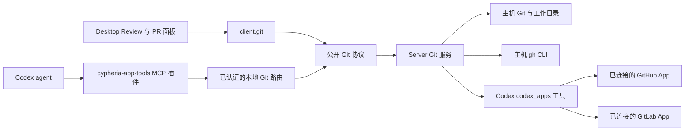

# 本地 Git 设计

本文说明 Cypheria 的本地 Codex Git 体验如何组成，以及各后端的选择依据。[Desktop](desktop.zh-CN.md) 负责说明可见的 Review 和 PR/MR 行为，[协议](protocol.zh-CN.md) 负责请求契约，[Integrations](integrations.zh-CN.md) 负责插件和 App 生命周期。Git 命令作用于 **Server 主机的工作目录**；本地仓库操作不要求连接 GitHub 或 GitLab 账户。

## 边界与数据流

`apps/server` 负责 Git 执行、仓库和工作树状态、connector 调用、校验及审计。`@cypheria/protocol` 校验公开消息，`@cypheria/client` 将能力提供给 Desktop。Electron main 只处理打开本地文件或 URL 等操作系统动作。renderer 不运行 Git、`gh` 或 connector 工具。随附的 Agent 插件调用同一 Server 能力；它是 Codex MCP 客户端，不实现 GitHub 或 GitLab App。

这是本地 Codex 工作流。远程客户端可以调用 Server 能力，操作的是该 Server 主机的文件系统；此设计不运行云端 checkout，也不会把 ChatGPT Work 当作本地仓库。

## 后端选择

| 操作 | 选用的后端与条件 |
| --- | --- |
| 仓库、分支、Review、提交、推送和工作树操作 | Server 内的主机 Git；除可用性检查和初始化外，操作需要可访问的本地仓库。 |
| GitHub PR 读取、差异、检查、讨论、创建和写入 | Desktop 优先选用已安装、已认证且可访问当前仓库的 `gh`；按操作分别选择。 |
| CLI 路径无法提供该操作时的 GitHub PR 读取或创建 | 需要本地 Codex 线程、启用的 GitHub connector 后备、仓库访问权，以及同一账户 link 上对应该操作的 `codex_apps` 工具组。App 对列表、账户搜索、详情、差异、活动、检查、线程、媒体和创建分别报告能力。其他 PR 写入需要 `gh`。 |
| 跨仓库 GitHub PR 看板 | 使用已认证的主机 `gh` 搜索账户可访问的仓库；可按状态、参与方式、文本和仓库筛选。 |
| GitLab MR 原生读取和写入 | 本地 Codex 线程通过已连接 GitLab App 的 `codex_apps` 工具执行。每个动作需要相应工具组、项目访问权及同一个账户 link。没有 `glab` 后端。 |
| GitLab MR 预填浏览器表单 | 主机 Git 校验已推送分支，Desktop 在系统浏览器打开 GitLab.com；这条路径无需 connector 写入工具。 |

安装 GitHub 或 GitLab 插件会使其声明的 App 对 Codex 可用，但安装、账户授权、工具发现和仓库访问是不同的状态。本地 Git 使用 `.git` 仓库和主机 Git 安装。`gh` 使用自己的当前 CLI 账户。App 调用使用通过 Codex 选定的 connector link；Cypheria 不把插件显示名当作账户，也不持有 connector 凭据。若两条路径都无法提供某项操作，该操作保持不可用并显示相应错误，不会悄悄改用其他认证途径。

Desktop 明确选择 GitHub 后端：可用的 CLI 优先；否则，仅在有本地线程时，才考虑已启用且报告了对应操作能力的 App 路径。GitLab 原生 MR 操作没有 CLI 后备。Server 在使用 App 数据前校验仓库 origin、connector、账户 link、工具 scope、项目、资源 URI 和返回的 URL。App 模型及外部浏览器连接流程详见 [Integrations](integrations.zh-CN.md)。

## Review 与修改安全

Review 汇集已暂存、未暂存、未提交、分支、提交及最后一轮来源。Server 固定基于提交的比较，并为可变文件提供 revision。执行段落操作前重新读取 revision；过期操作失败并刷新面板。补丁应用支持暂存与未暂存目标、反向与二进制补丁、可选原子检查和三方应用；批量结果区分已应用、跳过、冲突、过期和失败。撤销改动前会保存可恢复副本；文件在撤销后再次变化时，Undo 会拒绝恢复。

本地 Git 写入经过 Server 执行器与审计边界。初始审计写入失败会阻止操作。对现有 PR 的写入会比较面板显示的 head 提交和当前 PR head；connector 调用再次校验选定的账户及资源。提交成功后若推送失败，提交仍可单独重试推送。PR 创建结果不确定时，先重新读取或提示用户到 GitHub 核对，再允许另一次创建。提交和 PR 文案通过受管本地 Codex runtime 及保存的指令生成。显式“生成”操作会产生可编辑草稿；提交时字段为空也可触发生成。

## 工作树与持久状态

托管的 detached 工作树保存仓库身份、可选的所属 Cypheria 线程、setup 元数据及可恢复 Git ref。创建和线程迁移可在受保护的条件下复制本地改动。分支同步可通过临时索引创建合成快照，纳入未提交变更；同步校验分支基线和源 checkout，保留备份 ref，并支持 Undo。setup 可以捕获白名单内的工具链环境变量，供后续 Codex 线程启动、恢复和 fork 使用。保留数量清理会保护正在使用及含未提交改动的工作树；已归档线程被清理的工作树会在取消归档前恢复。

| 状态 | 所属位置与生命周期 |
| --- | --- |
| Git 偏好与文案指令 | Server 配置，跨 Desktop 会话共享。配置的工作树根目录在 Server 重启后生效。 |
| 线程身份和工作目录 | Server 持久状态；工作树归属保存在托管工作树元数据中。 |
| 工作树快照与同步备份 | 托管元数据及 Git 中的 `refs/cypheria/*`，用于恢复和受保护的 Undo。 |
| 最后一轮 tree 与 Review 撤销副本 | `CYPHERIA_HOME` 下的 Server 运行数据；跨进程重启保留，详见 [Desktop](desktop.zh-CN.md)。 |
| 选定的 Review 来源和 PR/聊天关联 | Desktop 浏览器存储，包括有上限的关联历史，供反向查找。 |
| 仓库发现缓存与文件系统监视器 | 只存在于 Server 内存。修改和监视事件会使发现结果失效并通知 Desktop；不支持监视时仍有定期读取。 |
| GitHub/GitLab App 连接 | Codex connector 账户状态；Cypheria 在执行支持的动作前检查当前工具和 link 可用性。 |

## Agent 工具与验证状态

`cypheria-bundled` marketplace 向 Cypheria 管理的 Codex home 分发 `cypheria-app-tools`。其工具通过已认证的公开 Git 路由，使用与 Desktop 相同的 Server 策略。该插件不声明 OpenAI App ID；GitHub 和 GitLab 插件分别提供自身的 App 声明与已连接工具。计划中：未来的 Cypheria 原生扩展可复用 Server 协议，而不改变 Git 能力的归属。

本地协议、Git、工作树、后端选择及 UI 检查覆盖了已实现路径。打包 Electron 的 Connect 行为，以及 Cypheria 管理的 Codex home 中 GitHub/GitLab 真实账户授权和 PR/MR 调用，仍属于明确的[验收任务](todo.zh-CN.md#本地-git-与拉取请求)；完成这些检查后才能宣称端到端对齐。
