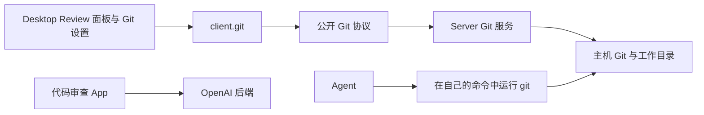

# 本地 Git 设计

本文说明 Cypheria 的本地 Git 体验如何组成，以及各后端的选择依据。[Desktop](desktop.zh-CN.md) 负责说明可见的 Review 行为，[代码审查](code-review.zh-CN.md) 负责 Pull Request 和合并请求，[协议](protocol.zh-CN.md) 负责请求契约，[Integrations](integrations.zh-CN.md) 负责插件生命周期。Git 命令作用于 **Server 主机的工作目录**；本地仓库操作不要求连接 GitHub 或 GitLab 账户。

## 边界与数据流

```mermaid
flowchart LR
  Desktop[Desktop Review 面板与 Git 设置] --> Client[client.git]
  Client --> Protocol[公开 Git 协议]
  Protocol --> Server[Server Git 服务]
  Server --> Git[主机 Git 与工作目录]
  Agent[Agent] --> Shell[在自己的命令中运行 git]
  Shell --> Git
  CodeReview[代码审查 App] --> Backend[OpenAI 后端]
```

`apps/server` 负责 Git 执行、仓库和工作树状态、校验及审计。`@cypheria/protocol` 校验公开消息，`@cypheria/client` 将能力提供给 Desktop。Electron main 只处理打开本地文件或 URL 等操作系统动作。renderer 不运行 Git。Pull Request 和合并请求不属于 Git 服务：[代码审查](code-review.zh-CN.md)通过 OpenAI 后端读写它们。

本地仓库与托管工作树能力不依赖具体 Agent，并统一使用 Cypheria Thread ID。远程客户端可以调用 Server 能力，操作的是该 Server 主机的文件系统；此设计不运行云端 checkout。

## 后端选择

| 操作 | 选用的后端与条件 |
| --- | --- |
| 仓库、分支、Review、提交、推送和工作树操作 | Server 内的主机 Git；除可用性检查和初始化外，操作需要可访问的本地仓库。 |
| GitHub Pull Request 与 GitLab 合并请求 | 通过 OpenAI 后端的[代码审查](code-review.zh-CN.md)，需要 ChatGPT 登录以及在 ChatGPT 中连接 GitHub 或 GitLab。没有 `gh` 或 `glab` 后端。 |

本地 Git 使用 `.git` 仓库和主机 Git 安装，不需要托管平台账户。Pull Request 功能需要[代码审查](code-review.zh-CN.md#前提条件)中的 ChatGPT 前提条件；缺少时这些功能保持不可用并说明原因，本地 Git 照常工作。

## Review 与修改安全

Review 汇集已暂存、未暂存、未提交、分支、提交及最后一轮来源。Server 固定基于提交的比较，并为可变文件提供 revision。执行段落操作前重新读取 revision；过期操作失败并刷新面板。补丁应用支持暂存与未暂存目标、反向与二进制补丁、可选原子检查和三方应用；批量结果区分已应用、跳过、冲突、过期和失败。撤销改动前会保存可恢复副本；文件在撤销后再次变化时，Undo 会拒绝恢复。

本地 Git 写入经过 Server 执行器与审计边界。初始审计写入失败会阻止操作。提交成功后若推送失败，提交仍可单独重试推送。提交文案通过受管本地 Codex runtime 及保存的指令生成。显式“生成”操作会产生可编辑草稿；提交时字段为空也可触发生成。

## 工作树与持久状态

托管的 detached 工作树保存稳定 UUID、仓库身份、可选的所属 Cypheria 线程、setup 元数据及可恢复 Git ref。创建和线程迁移可在受保护的条件下复制本地改动。工作树迁移使用公共 Thread 工作目录能力而非 Codex 身份，因此每个支持修改 `cwd` 的 Agent adapter 都能参与。分支同步可通过临时索引创建合成快照，纳入未提交变更；同步校验分支基线和源 checkout，保留备份 ref，并支持 Undo。setup 可以捕获白名单内的工具链环境变量，供支持该能力的 Agent adapter 后续启动使用。归档工作树时，会通过临时索引把其工作状态保存为快照 ref 下的一个提交，因此本地变更和未忽略的未跟踪文件都包含在内，恢复时从该提交重建检出目录；含 submodule 或嵌套仓库的工作树会拒绝归档。保留数量清理会保护正在使用及含未提交改动的工作树；已归档线程被清理的工作树会在取消归档前恢复。

| 状态 | 所属位置与生命周期 |
| --- | --- |
| Git 与代码审查偏好及文案指令 | Server 配置，跨 Desktop 会话共享。配置的工作树根目录在 Server 重启后生效。 |
| 线程身份、工作目录与 Git 附件 | Server 持久状态。`thread_attachments` 保存跨客户端 PR/工作树关系；托管工作树元数据同时执行主机生命周期约束。 |
| 工作树快照与同步备份 | 托管元数据及 Git 中的 `refs/cypheria/*`，用于恢复和受保护的 Undo。 |
| 最后一轮 tree 与 Review 撤销副本 | `CYPHERIA_HOME` 下的 Server 运行数据；跨进程重启保留，详见 [Desktop](desktop.zh-CN.md)。 |
| 选定的 Review 来源 | Desktop 客户端状态；只影响展示，不要求各客户端一致。 |
| 仓库发现缓存与文件系统监视器 | 只存在于 Server 内存。修改和监视事件会使发现结果失效并通知 Desktop；不支持监视时仍有定期读取。 |
| GitHub 与 GitLab 连接 | ChatGPT 账户状态，通过 OpenAI 后端读取；见[代码审查](code-review.zh-CN.md)。 |

## Agent 工具与验证状态

公开 Git 与 Thread Attachment 契约不依赖具体 Agent harness。Agent 不会以工具形式获得 Git 协议：它们自己运行 `git` 和 `gh`，通过 [Cypheria app tools](integrations.zh-CN.md#cypheria-app-tools) 附加拉取请求、管理 worktree，并通过随附的 `code-review` 插件读取拉取请求的检查。其他 Agent adapter（Pi、OpenCode 和 ACP）在同一个公开 service 边界拥有实现位置，无需建立第二套 Git 存储或附件模型。

本地协议、Git、工作树及 UI 检查覆盖了已实现路径。使用真实 ChatGPT 账户的代码审查实时调用仍属于明确的[验收任务](todo.zh-CN.md#本地-git-与拉取请求)；完成这些检查后才能宣称端到端对齐。
