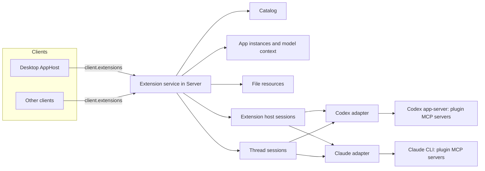

# Plugin Extensions

> Status: Planned. Today only the bundled Code Review App is hosted, through `client.mcpApps` and Desktop's `McpAppFrame`. Nothing else below is implemented.

Plugin Extensions let a plugin's MCP servers contribute product surfaces beyond model tools: entry points, file viewers, native settings, composer mentions, model context, and richer forms. Cypheria implements the host side of the [OpenAI MCP Extensions specification](https://github.com/openai/mcp-extensions/blob/main/docs/spec.md), which extends MCP and [MCP Apps](https://github.com/modelcontextprotocol/ext-apps). The plugin lifecycle stays in [Integrations](integrations.md); this document owns extension discovery, Agent routing, App hosting, and their security.

## Principles

- **Agents own plugins and MCP.** Agents install plugins and start, authenticate, and call MCP servers. The Server never starts a plugin's MCP server, never connects to one, and never interposes a proxy between an Agent and a server.
- **The Server owns extension state.** It turns what Agents report into a catalog, keeps App instances and their model context, answers file resources, and routes each App request to an Agent. Every client sees the same state.
- **Extension host sessions.** Surfaces without a conversation run their MCP calls in a hidden, non-persistent session of an Agent that can host them, like ChatGPT Desktop's `mcp_extension_host` Thread.
- **Agents differ.** Codex supports the whole specification. Other Agents support what their own APIs and configuration options allow, and the catalog reports exactly that. Missing support is not emulated.
- **Desktop follows ChatGPT Desktop** in surfaces and behavior, and uses the official MCP Apps library (`AppBridge`) for the App protocol.
- **One exception.** Bundled first-party plugins (`code-review`, `cypheria-app-tools`) are already Server code behind a relay; their App requests are answered in the Server so Code Review keeps working without Codex.

## Reference: ChatGPT Desktop

The ChatGPT Desktop build analyzed in the local `chatgpt-analysis` workspace (26.928.31416) and the Codex source show this division:

- **Codex app-server is the MCP client.** It owns plugins and connections, reports each server's tools with their raw `_meta`, `serverInfo`, and capabilities in `mcpServerStatus/list`, forwards `elicitation/create` and `openai/elicitation/create`, parses `onboardingSkill`, and records `McpAppUi` (resource URI and preferred display mode) on model tool calls. It advertises the MCP extensions its client declares in `initialize.capabilities.extensions`; Desktop declares `io.modelcontextprotocol/ui` with its App MIME types and `openai/elicitation` with `form`.
- **MCP connections belong to Threads.** Each Codex Thread owns its own MCP runtime, so a local stdio server runs once per Thread that uses it. `mcpServer/tool/call` requires a `threadId`.
- **The renderer interprets extensions.** It validates `_meta["openai/ui"]`, settings and mention capabilities tool by tool, builds sidebar, Thread, settings, file, and mention surfaces, and hosts Apps. It never connects to an MCP server itself.
- **`mcp_extension_host`.** A call without a Thread runs in a hidden Thread started with `ephemeral: true`, `permissions: ":read-only"`, and `threadSource: "mcp_extension_host"`, one per host, account, and user. It is created on first use, retired and replaced once after `Transport closed`, discarded on reconnect or configuration change, and its `thread/started` events are ignored. Settings, mention searches, and a global entry point before its first message use it.
- **Global entry points** open with a composer at the bottom right and an ephemeral Thread; the App stays as a permanent tab, and model context and messages go to that Thread.
- **Apps run in a sandbox guest** on `web-sandbox.oaiusercontent.com` (or the local `codex-sandbox:` scheme) behind a preload that passes only allowlisted messages.
- **Hosted plugins** come from ChatGPT's plugin service with precomputed extension fields and are called through OpenAI's backend. Cypheria does not support them.

## Architecture

`apps/server/src/extensions` owns the extension service and replaces `McpAppService`. Agent adapters expose one internal interface, `McpHost`, and declare what they support.

## Agent capabilities

`McpHost` is the adapter interface the extension service uses:

| Operation | Purpose |
| :- | :- |
| `openHostSession` / `closeHostSession` | A hidden, non-persistent session for calls without a conversation |
| `listServers` | Tools with `_meta`, server info, and capabilities |
| `readResource` | `resources/read` on a server, in a session |
| `callTool` | `tools/call` with `_meta`, in a session |
| Elicitation events | Forms and URL requests, raised as interactions |
| Tool call App metadata | The App a model tool call should render |

| Capability | Codex | Claude |
| :- | :- | :- |
| Host session | `thread/start` with `ephemeral`, `:read-only`, and `threadSource: "mcp_extension_host"` | An SDK session with `persistSession: false` |
| Tool metadata | Complete `_meta` and capabilities | Only the `ui` members of `_meta`; `openai/ui` and capabilities are withheld |
| Resource reads | Any URI | `ui://` URIs only (`readMcpResource`) |
| Tool calls | `mcpServer/tool/call` | Not available |
| Client extensions | Declared at `initialize` | Not available |
| Elicitation | Standard and `openai/elicitation/create` | Standard form and URL (`onElicitation`) |
| Model tool call Apps | `McpAppUi` on the item | Matched from the tool's `_meta.ui` in `mcpServerStatus()` |
| Onboarding | `plugin/read` returns `onboardingSkill` | Not reported |

Pi, OpenCode, and ACP Agents have no plugin support in Cypheria yet and offer no extensions. Pi connects MCP servers but omits MCP App resources and has no elicitation, so it would offer none even with plugins.

### Agent options used for extensions

Within the principles, an adapter uses its Agent's own options:

- **Codex:** the Codex adapter declares `io.modelcontextprotocol/ui` with `mimeTypes: ["text/html;profile=mcp-app"]` and `openai/elicitation` with `form` at `initialize`, so servers send App metadata and extended forms.
- **Claude:**
  - App-only tools (`_meta.ui.visibility` without `model`) are added to the session's disallowed tools, so the model does not see them, unless the CLI already hides them.
  - `onElicitation` turns form and URL elicitations into Thread interactions.
  - `readMcpResource` reads App resources without a model turn.

## Extension host sessions

The extension service keeps at most one host session per Agent and per Agent account. It opens one on first use, and replaces it after a transport failure, an Agent restart, an account change, or a plugin or MCP configuration change. A host session is not a Cypheria Thread: it never appears in Thread lists or the Timeline, and adapters drop its lifecycle notifications.

A request runs in one of two sessions:

- **The Thread's session**, for an App opened in a Thread whose Agent can make the call. The adapter resumes the native session if it is not loaded.
- **A host session**, for everything else. The host Agent for a plugin is the first Agent, in the order Codex then Claude, that has the plugin enabled and supports the operation.

So a Thread entry point in a Claude Thread can run through Codex's host session when the plugin is also enabled for Codex, while its model context and messages still go to the Claude Thread. A request that no Agent can serve is not offered.

## Feature support

| Feature | Codex | Claude |
| :- | :- | :- |
| Global, Thread, file, and settings entry points | Yes | No: entry points are not visible and tools cannot be called |
| Structured settings | Yes | No |
| Composer mentions | Yes | No |
| Apps from model tool calls | Interactive | Shown with the call's input and result; App tool calls and server resource reads are refused |
| Display modes, model context, `ui/message`, deep links, `openai/files/open` | Yes, for any App shown | Yes, for any App shown |
| File resources | Yes | No: there is no file entry point to open them |
| Extended forms | Yes | Standard forms only |
| Onboarding | Yes | When the plugin is also enabled for Codex |

A plugin enabled only for Claude therefore shows its Apps inline in Claude Threads and nothing else. Each catalog entry and App instance reports the Agent serving it and the reason a surface is missing.

## Catalog

The catalog is rebuilt from `listServers` of each Agent's host session when plugins, Agent enablement, or a server's tools change. Like ChatGPT Desktop, the Server validates tool by tool and records a diagnostic for anything it drops:

- **Entry points:** `_meta["openai/ui"].entrypoints`, with types `global` (optional `quickAction`), `thread`, `file` (extensions starting with `.`), and `settings` (optional `searchTerms`). A tool with entry points needs a `ui://` resource in `_meta.ui.resourceUri`.
- **Settings:** the server capability `openai/settings` under `extensions` or legacy `experimental`, whose `readTool` and `updateTool` are two distinct listed tools.
- **Mentions:** the capability `openai/mentions.searchTool`, or a tool marked `_meta["openai/extensions"]["mentions/search"]`. The tool must be read-only and visible to the App.
- **Onboarding:** the skill reported by the Agent.

Titles use `title`, then `annotations.title`, then `name`. Icons use the tool's `icons`, then the server icon, then a generic icon. The Server accepts only `data:` and `https:` icons and strips scripts from SVG. Clients draw monochrome SVG as a CSS mask, so `currentColor` follows the theme. An entry point is identified by `[plugin@marketplace, server, tool, type]`. Clients cache the last catalog in client storage, so the Sidebar renders before Agents start.

## App instances

An App instance is one mounted App with Server-side identity:

- **Global:** one per global entry point. The page shows the App as a permanent tab and a composer at the bottom right. The first message creates an ephemeral Thread for that page, and model context and messages target it.
- **Thread:** one per Thread and entry point, so every client showing that tab shares it.
- **File:** one per Thread, handler, and file.
- **Model tool call:** one per Timeline tool item carrying App metadata. It starts `inline` unless the resource's display modes prefer `fullscreen`.
- **Settings tool:** a temporary instance in a modal.

When an entry point opens, the Server calls its tool once, with `{}` or the file input, through the chosen session. It stores the result with the instance and gives it to every client that mounts the instance, so Apps render without calling the tool again. Model context is stored in SQLite with the Thread; results and file bindings stay in memory.

## Desktop App host

### Sandbox

Desktop matches ChatGPT Desktop's isolation, using the MCP Apps sandbox-proxy flow instead of a private preload protocol:

- Electron main registers a privileged `cypheria-sandbox:` scheme. Each App gets its own origin, `cypheria-sandbox://<hash of Agent, plugin, server, and resource>/`, which serves only a fixed proxy page.
- The renderer embeds the proxy in an iframe. `AppBridge` receives `onsandboxready` and sends the App HTML and its CSP from `_meta.ui.csp` with `sendSandboxResourceReady`. The proxy writes them into an inner sandboxed frame and relays messages.
- The frames get no preload, no Node.js, and no Cypheria IPC. Navigation away from the scheme is blocked, and popups open in the system browser.

### Bridge

`AppBridge` from `@modelcontextprotocol/ext-apps` handles initialization, tool input and results, host context, display modes, size changes, teardown, and standard requests. Cypheria adds the OpenAI extensions on the same bridge:

| Extension | Host behavior |
| :- | :- |
| Capabilities | `hostCapabilities.experimental` lists `openai/modelContext`, `openai/message`, `openai/files`, and, for file instances, `openai/resource`; `updateModelContext` and `message` list text, image, resource link, embedded resource, and structured content |
| Host context | `openai/deepLink`, `openai/modelContext`, and `openai/interactionCursor` next to the standard theme, locale, styles, and display mode |
| `ui/update-model-context` | Replaces the instance's context. Blocks become removable composer attachments for its Thread. Blocks for the assistant only are hidden but sent. `openai/title` and `openai/thumbnail` label them. Block `_meta` never reaches the model |
| `ui/message` | `_meta["openai/message"].target` of `active` or `new`. Titled text becomes a removable inline item. The input records the plugin as its origin |
| `openai/files/open` | The path is on the Server host and must be inside the Thread's workspace roots |
| `openai/resources/write` | Only for the instance's bound file resource |
| Tool calls and resource reads | Forwarded to the Server with the instance ID |
| `cypheria/*` requests | Bundled plugins only, such as `cypheria/codeReview/*` |

Display modes are `inline` and `fullscreen`; `pip` is not offered. Entry points open `fullscreen`.

### Surfaces

- **Sidebar:** global entry points with their icons and quick actions.
- **Global page:** the App and a composer, as described in [App instances](#app-instances).
- **Thread panel:** Thread entry points as tabs in the conversation's right panel, next to the Pull request tab.
- **Timeline:** inline Apps on tool items, with a fullscreen toggle.
- **File viewers:** the matching handler with the longest extension, offered beside the built-in viewer.
- **Plugin detail and Settings:** structured settings with native controls, settings entry points, and onboarding.
- **Composer:** model context attachments and a mention picker.
- **Deep links:** `cypheria://plugins/<plugin>@<marketplace>/app/<tool>?path=<encoded path>` opens a global entry point at that path. The decoded path starts with `/` and has no fragment.

## Requests from Apps

The Server checks every App request against its instance before routing it:

- Tool calls go only to the instance's own server, and only to tools whose `_meta.ui.visibility` includes `app`, plus the entry tool itself.
- Server resource reads go to the instance's own server.
- Settings layout tool items call only tools of the same server.
- Mention items become `mcp-resource` references; at turn start the Server reads the resource through the plugin's host Agent and passes it as an embedded resource, or as a labeled link when it cannot be read.
- Calls through a session that cannot make them fail with a typed `unsupported` error naming the missing capability.

## File entry points

File resources are host-handled, so the Server answers them from the workspace instead of the plugin server:

1. Opening a handler mints `cypheria-resource://<instance>/<token>`, bound to the instance and a canonical path inside the Thread's workspace roots. Symbolic links that leave the roots are refused.
2. The App and the entry tool receive `{ file: { name, resourceUri } }`.
3. `resources/read` on that URI returns text or base64 as requested by `_meta["openai/resource"].representation`, with `etag` (a content hash) and `writable`.
4. `resources/subscribe` watches the file and sends `notifications/resources/updated`.
5. `openai/resources/write` accepts only the bound URI, honors `ifMatch`, and answers `saved`, `conflict`, or `too-large`. Writes are refused when the Thread's sandbox forbids workspace writes.
6. Tool calls from that instance to its own server gain `_meta["openai/resource"].path` with the absolute path.

## Forms and elicitation

Elicitations raised during a turn become Thread interactions for every attached client, and the first response wins; see [Turns and interactions](protocol.md#turns-and-interactions). Elicitations raised by a call from an App or settings go only to the client that made the call. Extended fields (`pattern`, option descriptions, `x-openai-thumbnail`, `x-openai-suggestions`, and `x-openai-input` resource selection) are validated. A form with a field the client cannot render is answered as unsupported and never partially shown.

## Other clients

The Server and protocol are client-neutral. Expo can host Apps later through `react-native-webview` loading the same proxy page from the Server, and the CLI can show settings and mentions as prompts. Each client reports the surfaces it supports, and the catalog offers only those. Remote clients use the relay; resource text keeps arriving in 200,000-character pieces.

## Protocol

A new `extensions` capability replaces `mcp-apps`:

| Message | Purpose |
| :- | :- |
| `extension.catalog.get` / `extension.catalog.updated` | Catalog, revision, serving Agents, and diagnostics |
| `extension.app.open` | Create or attach to an instance; returns the resource in pieces, tool input, the stored result, and host context |
| `extension.app.request` | One App request for an instance |
| `extension.app.notification` | Resource updates and host context changes |
| `extension.app.close` | Detach a client |
| `extension.settings.read` / `extension.settings.update` | Structured settings |
| `extension.mentions.search` | Mention search |
| `extension.files.handlers` | File handlers for a file reference |

The common Timeline `tool` item gains optional App metadata: server, resource URI, and preferred display mode. Thread input gains an origin for App-sent messages, and model context attachments become Thread state.

## Libraries

- `@modelcontextprotocol/ext-apps` 2.x provides `AppBridge` and the sandbox-proxy messages in Desktop.
- `@openai/mcp-extensions` 0.1 targets `ext-apps` 1.x and `@modelcontextprotocol/sdk` 1.x, so it is not a runtime dependency. `@cypheria/protocol` defines the host-side schemas from the specification, and conformance tests check them against the SDK's exported schemas.
- The repository's Bits & Bolts plugin, which exercises every extension, is the end-to-end fixture for Codex.

## Security

- App frames are untrusted. They get no tokens, Server URLs, raw paths, private keys, or signing.
- App tool calls run without model approval prompts. A plugin server must not expose Web3 signing; signing stays behind Server policy as in [Web3](web3.md).
- Host sessions are read-only and non-persistent.
- File access is confined to workspace roots. Model context and messages have size and rate limits.
- Extension tool calls, file writes, App-sent messages, and settings updates are audited with plugin, server, tool, instance, Agent, and client.

## Rollout

1. Extension service and protocol, the Codex `McpHost` with host sessions and client extensions, catalog and validation, the Desktop sandbox proxy and bridge, global and Thread entry points, display modes, and structured settings. Code Review moves onto the new API.
2. Model context, `ui/message`, deep links, and Apps on model tool calls for Codex and Claude.
3. File entry points and resources, and `openai/files/open`.
4. Mentions, extended forms, and onboarding.

## Verification before implementation

- A Claude SDK session with `persistSession: false` can answer `mcpServerStatus()` and `readMcpResource` before any prompt.
- Whether the Claude CLI already hides App-only tools from the model.
- Codex `mcpServer/tool/call` on a Thread whose session must be resumed first.
