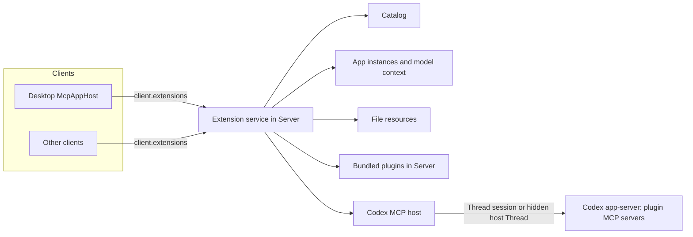

# Plugin Extensions

Plugin Extensions let a plugin's MCP servers contribute product surfaces beyond model tools: entry points, file viewers, native settings, composer mentions, model context, and richer forms. Cypheria implements the host side of the [OpenAI MCP Extensions specification](https://github.com/openai/mcp-extensions/blob/main/docs/spec.md), which extends MCP and [MCP Apps](https://github.com/modelcontextprotocol/ext-apps). The plugin lifecycle stays in [Integrations](integrations.md); this document owns extension discovery, Agent routing, App hosting, and their security.

## Principles

- **Agents own plugins and MCP.** Agents install plugins and start, authenticate, and call MCP servers. The Server never starts a plugin's MCP server, never connects to one, and never interposes a proxy between an Agent and a server.
- **The Server owns extension state.** It turns what Agents report into a catalog, keeps App instances and their model context, answers file resources, and routes each App request to an Agent. Every client sees the same state.
- **Extension host sessions.** Surfaces without a loaded conversation run their MCP calls in a hidden, non-persistent session of the Agent that hosts the plugin, like ChatGPT Desktop's `mcp_extension_host` Thread.
- **Agents differ.** Codex supports the specification. Other Agents offer no extensions yet, and missing support is not emulated.
- **Desktop follows ChatGPT Desktop** in surfaces and behavior, and uses the official MCP Apps library (`AppBridge`) for the App protocol.
- **One exception.** Bundled first-party plugins (`code-review`, `cypheria-app-tools`) are Server code behind a relay; the Server answers their App requests itself, so Code Review works without Codex.

## Reference: ChatGPT Desktop

The ChatGPT Desktop build analyzed in the local `chatgpt-analysis` workspace (26.928.31416) and the Codex source show this division:

- **Codex app-server is the MCP client.** It owns plugins and connections, reports each server's tools with their raw `_meta`, `serverInfo`, and capabilities in `mcpServerStatus/list`, forwards `elicitation/create` and `openai/elicitation/create`, parses `onboardingSkill`, and records `McpAppUi` (resource URI and preferred display mode) on model tool calls. It advertises the MCP extensions its client declares in `initialize.capabilities.extensions`.
- **MCP connections belong to Threads.** Each Codex Thread owns its own MCP runtime, so a local stdio server runs once per Thread that uses it. `mcpServer/tool/call` requires a `threadId`.
- **The renderer interprets extensions.** It validates `_meta["openai/ui"]`, settings, and mention capabilities tool by tool, builds sidebar, Thread, settings, file, and mention surfaces, and hosts Apps. It never connects to an MCP server itself.
- **`mcp_extension_host`.** A call without a Thread runs in a hidden Thread started with `ephemeral: true`, `permissions: ":read-only"`, and `threadSource: "mcp_extension_host"`. It is created on first use, replaced once after `Transport closed`, and its `thread/started` events are ignored.
- **Apps run in a sandbox guest** on a separate origin behind a preload that passes only allowlisted messages.
- **Hosted plugins** come from ChatGPT's plugin service with precomputed extension fields and are called through OpenAI's backend. Cypheria does not support them.

## Architecture

`apps/server/src/extensions` owns the extension service. Hosts implement one internal interface, `McpHost`: `BundledMcpHost` answers bundled plugins, and `CodexMcpHost` asks Codex. Each host declares whether it reports full tool metadata, calls tools, and reads any resource; the catalog and App capabilities follow those declarations.

## Codex host

- **Client extensions.** The Codex adapter declares `io.modelcontextprotocol/ui` with `mimeTypes: ["text/html;profile=mcp-app"]` and `openai/elicitation` with `form` at `initialize`, so servers send App metadata and extended forms.
- **Inventory.** `mcpServerStatus/list` reports every server with its tools, raw `_meta`, server info, and capabilities. Codex Apps (`codex_apps`) and Cypheria's bundled plugins are left out.
- **Sessions.** A call made for an App in a Cypheria Thread whose Codex session is loaded runs in that session, so the App reaches the server instance that produced its result. Every other call runs in one hidden Thread started with `ephemeral: true`, `permissions: ":read-only"`, and `threadSource: "mcp_extension_host"`. The Codex runtime drops that Thread's notifications and sends its reverse requests to the extension service. After `Transport closed` or an unknown Thread, the hidden Thread is replaced once and the call retried.
- **Elicitation.** A form or URL request raised in the hidden Thread goes to the client whose call is waiting on that server; anything else the hidden Thread asks is refused.

Calls wait up to five minutes and reads up to one minute.

## Catalog

The catalog is rebuilt when a client asks after a minute, when it asks for a refresh, and after plugin, marketplace, or MCP changes. A changed catalog gets a new revision, which the Server announces. Like ChatGPT Desktop, the Server validates tool by tool and records a diagnostic for anything it drops:

- **Entry points:** `_meta["openai/ui"].entrypoints`, with types `global` (optional `quickAction`), `thread`, `file` (extensions starting with `.`), and `settings` (optional `searchTerms`). A tool with entry points needs a `ui://` resource in `_meta.ui.resourceUri`.
- **Settings:** the server capability `openai/settings` under `extensions` or legacy `experimental`, whose `readTool` and `updateTool` are two distinct listed tools.
- **Mentions:** the capability `openai/mentions.searchTool`, which must be read-only, or a tool marked `_meta["openai/extensions"]["mentions/search"]`, which must be visible to the App.

Titles use `title`, then `annotations.title`, then `name`. Icons use the tool's `icons`, then the server icon. The Server accepts only `https:` and image `data:` icons and strips scripts from SVG; Desktop draws SVG as a CSS mask so `currentColor` follows the theme. An entry point is identified by `[plugin@marketplace, server, tool, type]`, and a plugin enabled for several Agents appears once. Desktop caches the last catalog in client storage, so the Sidebar shows plugin pages before Agents start.

## App instances

An App instance is one mounted App with Server-side identity. Instances of an entry point or a tool call are shared, so every client showing the same App in the same chat attaches to one instance; an instance ends when its last client closes it or disconnects.

- **Global:** the App of a global entry point, alone or beside a chat.
- **Thread:** one per Thread and entry point.
- **File:** one per Thread, handler, and file.
- **Tool call:** one per Timeline tool item whose tool declares an App.
- **Tool:** a temporary instance, such as a settings layout's App or Code Review's page.

When an entry point opens, the Server calls its tool once, with `{}` or the file input, and stores the result, so Apps render without calling the tool again. A tool call's App renders from the call's recorded input and result instead. Display modes come from the resource's `_meta["openai/ui"]`: `availableDisplayModes`, otherwise the preferred mode alone, otherwise both `inline` and `fullscreen`; `pip` is never offered. Entry points start `fullscreen` and tool calls `inline` unless the App prefers otherwise.

## Requests from Apps

The Server checks every App request against its instance before routing it:

| Request | Behavior |
| :- | :- |
| `tools/call` | Only to the instance's own server: its entry tool, and tools whose `_meta.ui.visibility` includes `app`. A file instance's calls add `_meta["openai/resource"].path` |
| `resources/read` | The instance's file, or the server's own resources |
| `ui/update-model-context` | Replaces the App's context in its chat; see [Model context](#model-context) |
| `ui/message` | Sends a message to the instance's chat, or to a new chat with `_meta["openai/message"].target: "new"`. An App without a chat starts one. The message records the App as its origin, at most ten a minute |
| `resources/subscribe`, `resources/unsubscribe`, `openai/resources/write` | The instance's own file only; see [File entry points](#file-entry-points) |
| `openai/files/open` | A file inside the chat's workspace roots, which the chat opens in a file tab |
| `cypheria/*` | Bundled plugins only, such as Code Review's `cypheria/codeReview/*`, answered by Desktop |

Text, image, resource link, and embedded resource blocks are accepted, up to 512 KiB at once; audio is refused.

## Model context

Each App's latest `ui/update-model-context` belongs to its chat, keyed by what the App renders, so it survives reopening the App. Every client shows the visible blocks as removable composer attachments; blocks whose `annotations.audience` excludes the user are sent without being shown, and `openai/title` and `openai/thumbnail` label them. Removing a block from any client tells the App through `hostContext["openai/modelContext"]`.

A global page's App may attach context before its page has a chat. It waits with the instance and goes to the chat its first message creates. When the page moves the App to another chat, or to none for a new one, the context it attached to the previous chat is copied along.

The chat's next message carries every App's context as text and images, each under its App's name; block `_meta` never reaches the model. Once that turn starts, the context is cleared and the Apps receive `null`. Model context lives in Server memory and does not survive a Server restart.

## File entry points

File resources are answered by the Server from the workspace, not by the plugin's server:

1. A file tab whose name matches a file entry point shows a viewer bar with Cypheria's own viewer and each matching handler. It opens in the viewer the person chose for the file's extension, else in Cypheria's own viewer when it previews the type (images, Markdown, SVG, and CSV or TSV tables), else in the handler with the longest matching extension. Choosing a viewer saves it under the longest matching extension in Server configuration (`workspace.fileViewers`, a handler's entry point ID or `builtin`), merged by extension so clients never overwrite each other's choices; a choice whose handler is gone falls back to the default order.
2. Opening it binds an opaque `cypheria-resource://<instance>/<token>` URI to the file's canonical path, which must be a regular file inside the chat's workspace roots. Symbolic links that leave the roots are refused.
3. The App and the entry tool receive `{ file: { name, resourceUri } }`.
4. `resources/read` returns text or base64, as `_meta["openai/resource"].representation` asks or by content, with `etag` (a content hash) and `writable: true`.
5. `resources/subscribe` watches the file and sends `notifications/resources/updated`.
6. `openai/resources/write` honors `ifMatch` and answers `saved`, `conflict`, or `too-large`; files are read and written up to 20 MiB, atomically.

## Settings, mentions, forms, and onboarding

- **Structured settings.** The plugin detail page shows each server's settings with native controls, grouped by `layout`, with ungrouped fields under **Other settings**. A change calls the update tool with only the changed values. A layout tool item runs a regular tool and shows its text, or opens an App tool in a modal; settings entry points open there too.
- **Mentions.** Typing after `@` in the composer searches every plugin's mention tool, each within five seconds. A chosen item becomes an `mcp-resource` reference; when the message is sent, the Server reads the resource through the plugin's host and passes its text or image, or a labeled link when it cannot be read.
- **Forms.** Thread interactions and extension calls render form elicitations with standard fields and OpenAI's extensions: `pattern`, option `description`, `x-openai-thumbnail`, `x-openai-suggestions`, and `x-openai-input` resource selection among offered resources. A form with a field Cypheria cannot collect, such as implicit selection with uploads or nested objects, offers only Decline and is never shown partly. Elicitations from extension calls go only to the client that made the call; those raised during a turn are Thread interactions for every attached client.
- **Onboarding.** Codex reports the skill a plugin's manifest names in `extensions["com.openai"].onboardingSkill`; the plugin detail page offers **Set up**, which starts a chat that runs it.

## Desktop App host

### Sandbox

- Electron main serves a fixed proxy page on a privileged `cypheria-sandbox:` scheme. Each App gets its own origin, `cypheria-sandbox://a<hash of Agent, plugin, server, and resource>/`, so it has storage of its own and shares nothing with the renderer or other Apps.
- `McpAppHost` embeds the proxy in a sandboxed iframe. `AppBridge` answers the proxy's `ui/notifications/sandbox-proxy-ready` with `sendSandboxResourceReady`, sending the App document with a Content Security Policy derived from `_meta.ui.csp` and the declared permissions; the proxy loads it into an inner frame and relays messages.
- The frames get no preload, no Node.js, and no Cypheria IPC. Frames inside an App cannot navigate away from sandbox origins, and links open through `ui/open-link`.

### Surfaces

- **Sidebar:** plugin global entry points, after Code Review.
- **Global page:** `/plugins/<plugin>@<marketplace>/app/<tool>`, the App filling the page with a chat floating at the bottom right, as ChatGPT Desktop's workspace pages show one. The first message creates an ordinary chat that stays in the panel; the panel's header chooses another recent chat, starts a new one, or opens the chat on the conversation page. The Server keeps the page's chat as the workspace thread `mcp-app:<entry point>`, so every client returns to it. The App follows whichever chat the panel shows without reopening, and a chat the App starts with `ui/message` opens in the panel.
- **Deep links:** `cypheria://plugins/<plugin>@<marketplace>/app/<tool>?path=<encoded path>` opens the global page; the App receives the path as `hostContext["openai/deepLink"]`.
- **Conversation side panel:** each Thread entry point is a tab, and the global App a chat began from opens there.
- **Timeline:** a tool call that declares an App shows it inline, sized by the App, with a fullscreen toggle that keeps the same frame.
- **File tabs, plugin detail, composer, and forms:** as described above. User messages an App sent are labeled with the App's name.

## Protocol

The `extensions` capability carries:

| Message | Purpose |
| :- | :- |
| `extension.catalog.get` / `extension.catalog.updated` | Catalog, revision, serving Agents, and diagnostics |
| `extension.app.open` | Create or attach to an instance for an entry point, tool call, or tool |
| `extension.app.resource.read` | The App document, in 200,000-character pieces |
| `extension.app.request` | One App request for an instance |
| `extension.app.notification` | MCP notifications and host context changes for open instances |
| `extension.app.bind` | Move a global page's instance to another chat, or to none, with its context |
| `extension.app.close` | Detach a client |
| `extension.context.list` / `extension.context.remove` / `extension.context.updated` | Model context of a chat |
| `extension.settings.read` / `extension.settings.update` / `extension.settings.tool` | Structured settings and their layout tools |
| `extension.mentions.search` | Mention search |
| `extension.elicitation` / `extension.elicitation.respond` | Forms raised by a client's extension calls |

The common Timeline `tool` item carries an optional `app` (server, plugin, tool, resource URI, and preferred display mode), and user messages carry an optional `origin` when an App sent them. `@cypheria/protocol` defines the specification's host-side schemas in `openai-mcp-extensions.ts`; `@openai/mcp-extensions` targets `ext-apps` 1.x and is not a dependency.

## Security

- App frames are untrusted. They get no tokens, Server URLs, raw paths, private keys, or signing.
- App tool calls run without model approval prompts. A plugin server must not expose Web3 signing; signing stays behind Server policy as in [Web3](web3.md).
- The hidden host Thread is read-only and non-persistent.
- File access is confined to workspace roots by canonical path, and Apps see only opaque URIs.
- Model context, messages, and file transfers have size limits, and messages a rate limit.

## Limits

> Planned: the items below are not implemented.

- Claude: render-only Apps of Claude tool calls from `mcpServerStatus()` and `readMcpResource`, and hiding App-only tools from the model. Pi, OpenCode, and ACP offer no extensions.
- Expo and CLI hosting of Apps, settings, and mentions, and third-party `cypheria/*` host requests.
- Uploading files to forms, and implicit resource selection.
