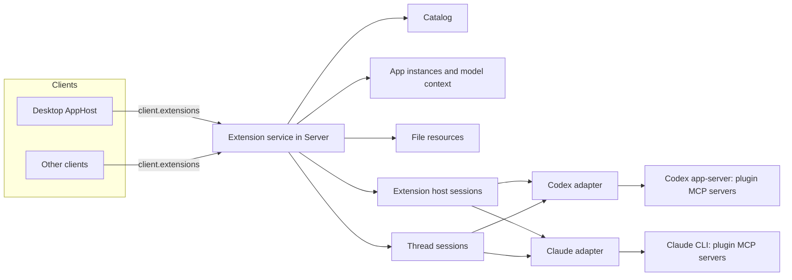

# Plugin Extensions

> 状态：计划中。目前只有内置的 Code Review App 通过 `client.mcpApps` 与 Desktop 的 `McpAppFrame` 托管。下文其余内容均未实现。

Plugin Extensions 让插件的 MCP server 在模型工具之外提供产品界面：入口、文件查看器、原生设置、composer 提及、模型上下文和更丰富的表单。Cypheria 实现 [OpenAI MCP Extensions 规范](https://github.com/openai/mcp-extensions/blob/main/docs/spec.md) 的 host 侧，该规范扩展了 MCP 与 [MCP Apps](https://github.com/modelcontextprotocol/ext-apps)。插件生命周期仍由 [Integrations](integrations.zh-CN.md) 负责；本文负责 extension 的发现、Agent 路由、App 托管及其安全。

## 原则

- **插件与 MCP 归 Agent 管理。** Agent 安装插件，并启动、认证和调用 MCP server。Server 从不启动插件的 MCP server，从不连接它，也从不在 Agent 与 server 之间插入代理。
- **Extension 状态归 Server。** Server 把 Agent 报告的内容整理成 catalog，保存 App 实例及其模型上下文，响应文件 resource，并把每个 App 请求路由给某个 Agent。所有客户端看到同一份状态。
- **Extension host session。** 没有对话的界面，其 MCP 调用运行在某个能承载它的 Agent 的隐藏、非持久 session 中，对应 ChatGPT Desktop 的 `mcp_extension_host` Thread。
- **Agent 能力不同。** Codex 支持完整规范。其他 Agent 只支持其自身 API 与配置选项允许的部分，catalog 如实报告。缺失的能力不做模拟。
- **Desktop 对齐 ChatGPT Desktop** 的界面与行为，并使用官方 MCP Apps 库（`AppBridge`）处理 App 协议。
- **一个例外。** 内置第一方插件（`code-review`、`cypheria-app-tools`）本来就是 relay 背后的 Server 代码；它们的 App 请求在 Server 内响应，使 Code Review 在没有 Codex 时也能工作。

## 参考：ChatGPT Desktop

本地 `chatgpt-analysis` 工作区分析的 ChatGPT Desktop 构建（26.928.31416）与 Codex 源码显示如下分工：

- **Codex app-server 是 MCP client。** 它负责插件与连接；在 `mcpServerStatus/list` 中报告每个 server 的工具及其原始 `_meta`、`serverInfo` 与 capability；转发 `elicitation/create` 与 `openai/elicitation/create`；解析 `onboardingSkill`；并在模型工具调用上记录 `McpAppUi`（resource URI 与首选显示模式）。它向 MCP server 声明其客户端在 `initialize.capabilities.extensions` 中声明的 MCP extension；Desktop 声明带 App MIME 类型的 `io.modelcontextprotocol/ui`，以及带 `form` 的 `openai/elicitation`。
- **MCP 连接属于 Thread。** 每个 Codex Thread 拥有自己的 MCP runtime，因此本地 stdio server 在每个使用它的 Thread 中各运行一次。`mcpServer/tool/call` 必须带 `threadId`。
- **Renderer 负责解读 extension。** 它逐个工具校验 `_meta["openai/ui"]`、设置与提及 capability，构建侧栏、Thread、设置、文件与提及界面，并托管 App。它自己从不连接 MCP server。
- **`mcp_extension_host`。** 没有 Thread 的调用运行在一个以 `ephemeral: true`、`permissions: ":read-only"` 和 `threadSource: "mcp_extension_host"` 启动的隐藏 Thread 中，每个 host、账号与用户一个。它在首次使用时创建，遇到 `Transport closed` 时退役并替换一次，重连或配置变更时丢弃，其 `thread/started` 事件被忽略。设置、提及搜索以及首条消息前的 global 入口都使用它。
- **Global 入口** 打开时右下角有 composer 与一个 ephemeral Thread；App 作为常驻标签页保留，模型上下文与消息发往该 Thread。
- **App 运行在沙箱 guest 中**，位于 `web-sandbox.oaiusercontent.com`（或本地 `codex-sandbox:` scheme），由只放行白名单消息的 preload 隔离。
- **托管插件** 来自 ChatGPT 插件服务，extension 字段由后端预先计算，并通过 OpenAI 后端调用。Cypheria 不支持它们。

## 架构

`apps/server/src/extensions` 负责 extension service，并取代 `McpAppService`。各 Agent adapter 暴露同一个内部接口 `McpHost`，并声明自己支持哪些能力。

## Agent 能力

`McpHost` 是 extension service 使用的 adapter 接口：

| 操作 | 用途 |
| :- | :- |
| `openHostSession` / `closeHostSession` | 供没有对话的调用使用的隐藏、非持久 session |
| `listServers` | 工具及其 `_meta`、server 信息与 capability |
| `readResource` | 在某个 session 中对 server 执行 `resources/read` |
| `callTool` | 在某个 session 中带 `_meta` 执行 `tools/call` |
| Elicitation 事件 | 表单与 URL 请求，作为 interaction 提出 |
| 工具调用 App metadata | 模型工具调用应渲染的 App |

| 能力 | Codex | Claude |
| :- | :- | :- |
| Host session | 以 `ephemeral`、`:read-only` 和 `threadSource: "mcp_extension_host"` 调用 `thread/start` | `persistSession: false` 的 SDK session |
| 工具 metadata | 完整 `_meta` 与 capability | 只有 `_meta` 的 `ui` 成员；`openai/ui` 与 capability 被过滤 |
| Resource 读取 | 任意 URI | 仅 `ui://` URI（`readMcpResource`） |
| 工具调用 | `mcpServer/tool/call` | 不可用 |
| 客户端 extension | 在 `initialize` 时声明 | 不可用 |
| Elicitation | 标准与 `openai/elicitation/create` | 标准 form 与 URL（`onElicitation`） |
| 模型工具调用 App | 工具项上的 `McpAppUi` | 根据 `mcpServerStatus()` 中工具的 `_meta.ui` 匹配 |
| 引导 | `plugin/read` 返回 `onboardingSkill` | 不报告 |

Pi、OpenCode 与 ACP Agent 在 Cypheria 中尚无插件支持，不提供 extension。Pi 能连接 MCP server，但会忽略 MCP App resource，也没有 elicitation，因此即使支持插件也不提供 extension。

### 为 extension 使用的 Agent 选项

在上述原则内，adapter 使用其 Agent 自身的选项：

- **Codex：** Codex adapter 在 `initialize` 时声明带 `mimeTypes: ["text/html;profile=mcp-app"]` 的 `io.modelcontextprotocol/ui` 与带 `form` 的 `openai/elicitation`，使 server 发送 App metadata 与扩展表单。
- **Claude：**
  - 仅供 App 使用的工具（`_meta.ui.visibility` 不含 `model`）会加入 session 的禁用工具列表，使模型看不到它们，除非 CLI 已经隐藏了它们。
  - `onElicitation` 把 form 与 URL elicitation 转为 Thread interaction。
  - `readMcpResource` 在没有模型 turn 的情况下读取 App resource。

## Extension host session

Extension service 为每个 Agent 及其每个账号最多保留一个 host session。首次使用时打开；在传输失败、Agent 重启、账号变更或插件与 MCP 配置变更后替换。Host session 不是 Cypheria Thread：它从不出现在 Thread 列表或 Timeline 中，adapter 丢弃其生命周期通知。

请求运行在以下两种 session 之一：

- **Thread 的 session**：用于在 Thread 中打开、且该 Thread 的 Agent 能完成该调用的 App。原生 session 未加载时，adapter 先恢复它。
- **Host session**：用于其他所有情况。插件的 host Agent 是按 Codex、Claude 顺序第一个启用了该插件并支持该操作的 Agent。

因此，当插件也为 Codex 启用时，Claude Thread 中的 Thread 入口可以通过 Codex 的 host session 运行，而它的模型上下文与消息仍发往该 Claude Thread。没有任何 Agent 能完成的请求不会被提供。

## 功能支持

| 功能 | Codex | Claude |
| :- | :- | :- |
| Global、Thread、文件与设置入口 | 支持 | 不支持：入口不可见，工具也无法调用 |
| 结构化设置 | 支持 | 不支持 |
| Composer 提及 | 支持 | 不支持 |
| 模型工具调用产生的 App | 可交互 | 带该调用的输入与结果显示；App 的工具调用与 server resource 读取被拒绝 |
| 显示模式、模型上下文、`ui/message`、deep link、`openai/files/open` | 对任何已显示的 App 支持 | 对任何已显示的 App 支持 |
| 文件 resource | 支持 | 不支持：没有可打开它们的文件入口 |
| 扩展表单 | 支持 | 仅标准表单 |
| 引导 | 支持 | 插件同时为 Codex 启用时支持 |

因此，只为 Claude 启用的插件只会在 Claude Thread 中内联显示其 App，其他界面均不可用。每个 catalog 项与 App 实例都会报告为其服务的 Agent，以及某个界面缺失的原因。

## Catalog

当插件、Agent 启用状态或 server 工具变化时，catalog 根据各 Agent host session 的 `listServers` 重建。与 ChatGPT Desktop 一样，Server 逐个工具校验，并为丢弃的内容记录诊断：

- **入口：** `_meta["openai/ui"].entrypoints`，类型为 `global`（可选 `quickAction`）、`thread`、`file`（扩展名以 `.` 开头）与 `settings`（可选 `searchTerms`）。带入口的工具需要在 `_meta.ui.resourceUri` 中提供 `ui://` resource。
- **设置：** `extensions` 或旧的 `experimental` 下的 server capability `openai/settings`，其 `readTool` 与 `updateTool` 是两个不同且已列出的工具。
- **提及：** capability `openai/mentions.searchTool`，或标记了 `_meta["openai/extensions"]["mentions/search"]` 的工具。该工具必须只读且对 App 可见。
- **引导：** Agent 报告的 skill。

标题依次取 `title`、`annotations.title`、`name`。图标依次取工具的 `icons`、server 图标、通用图标。Server 只接受 `data:` 与 `https:` 图标，并去除 SVG 中的脚本。客户端把单色 SVG 作为 CSS mask 绘制，使 `currentColor` 跟随主题。入口身份为 `[plugin@marketplace, server, tool, type]`。客户端把最近的 catalog 缓存在客户端存储中，使侧栏在 Agent 启动前即可渲染。

## App 实例

App 实例是一个已挂载的 App，身份由 Server 持有：

- **Global：** 每个 global 入口一个。页面把 App 显示为常驻标签页，右下角有 composer。第一条消息为该页面创建一个 ephemeral Thread，模型上下文与消息以它为目标。
- **Thread：** 每个 Thread 与入口组合一个，因此显示该标签页的所有客户端共享它。
- **文件：** 每个 Thread、handler 与文件组合一个。
- **模型工具调用：** 每个带 App metadata 的 Timeline 工具项一个。默认以 `inline` 开始，除非 resource 的显示模式偏好 `fullscreen`。
- **设置工具：** 模态框中的临时实例。

入口打开时，Server 通过所选 session 调用其工具一次，参数为 `{}` 或文件输入。结果与实例一起保存，并交给挂载该实例的每个客户端，因此 App 无需再次调用工具即可渲染。模型上下文随 Thread 存入 SQLite；结果与文件绑定保存在内存中。

## Desktop App host

### 沙箱

Desktop 对齐 ChatGPT Desktop 的隔离方式，但使用 MCP Apps 的 sandbox-proxy 流程，而不是私有的 preload 协议：

- Electron main 注册特权 scheme `cypheria-sandbox:`。每个 App 拥有自己的 origin `cypheria-sandbox://<Agent、插件、server 与 resource 的哈希>/`，该 origin 只提供一个固定的 proxy 页面。
- Renderer 用 iframe 嵌入 proxy。`AppBridge` 收到 `onsandboxready` 后，用 `sendSandboxResourceReady` 发送 App HTML 及其来自 `_meta.ui.csp` 的 CSP。proxy 把它们写入内层沙箱 frame 并转发消息。
- 这些 frame 没有 preload、没有 Node.js、没有 Cypheria IPC。离开该 scheme 的导航被阻止，弹窗在系统浏览器中打开。

### Bridge

`@modelcontextprotocol/ext-apps` 的 `AppBridge` 处理初始化、工具输入与结果、host context、显示模式、尺寸变化、teardown 与标准请求。Cypheria 在同一个 bridge 上加入 OpenAI extension：

| Extension | Host 行为 |
| :- | :- |
| Capability | `hostCapabilities.experimental` 列出 `openai/modelContext`、`openai/message`、`openai/files`，文件实例另列 `openai/resource`；`updateModelContext` 与 `message` 列出 text、image、resource link、embedded resource 与 structured content |
| Host context | 在标准的主题、语言、样式与显示模式之外，提供 `openai/deepLink`、`openai/modelContext` 与 `openai/interactionCursor` |
| `ui/update-model-context` | 替换该实例的上下文。内容块成为其 Thread 的可移除 composer 附件。仅给 assistant 的块隐藏但仍发送。`openai/title` 与 `openai/thumbnail` 作为标签。块的 `_meta` 永不进入模型 |
| `ui/message` | `_meta["openai/message"].target` 为 `active` 或 `new`。带标题的文本成为可移除的内联项。输入记录插件作为来源 |
| `openai/files/open` | 路径位于 Server 主机，且必须在 Thread 工作区根目录内 |
| `openai/resources/write` | 仅限该实例绑定的文件 resource |
| 工具调用与 resource 读取 | 带实例 ID 转发给 Server |
| `cypheria/*` 请求 | 仅限内置插件，例如 `cypheria/codeReview/*` |

显示模式为 `inline` 与 `fullscreen`；不提供 `pip`。入口以 `fullscreen` 打开。

### 界面

- **侧栏：** global 入口及其图标与快捷操作。
- **Global 页面：** App 与 composer，见 [App 实例](#app-实例)。
- **Thread 面板：** Thread 入口作为对话右侧面板的标签页，位于 Pull request 标签页旁边。
- **Timeline：** 工具项上的内联 App，可切换全屏。
- **文件查看器：** 扩展名匹配最长的 handler，与内置查看器并列提供。
- **插件详情与设置：** 使用原生控件的结构化设置、设置入口与引导。
- **Composer：** 模型上下文附件与提及选择器。
- **Deep link：** `cypheria://plugins/<plugin>@<marketplace>/app/<tool>?path=<编码后的路径>` 在该路径打开 global 入口。解码后的路径以 `/` 开头且不含 fragment。

## App 发出的请求

Server 在路由之前，按实例检查每个 App 请求：

- 工具调用只能发往实例自身的 server，且只限 `_meta.ui.visibility` 包含 `app` 的工具，以及入口工具本身。
- Server resource 读取只能发往实例自身的 server。
- 设置布局中的工具项只能调用同一 server 的工具。
- 提及项成为 `mcp-resource` 引用；turn 开始时，Server 通过插件的 host Agent 读取该 resource，并作为 embedded resource 传入；无法读取时以带标签的链接传入。
- 通过无法完成该调用的 session 发出的调用，以带类型的 `unsupported` 错误失败，并指明缺失的能力。

## 文件入口

文件 resource 由 host 处理，因此 Server 从工作区响应，而不是由插件 server 响应：

1. 打开 handler 时生成 `cypheria-resource://<instance>/<token>`，绑定到实例以及 Thread 工作区根目录内的规范路径。指向根目录之外的符号链接会被拒绝。
2. App 与入口工具收到 `{ file: { name, resourceUri } }`。
3. 对该 URI 的 `resources/read` 按 `_meta["openai/resource"].representation` 返回 text 或 base64，并带有 `etag`（内容哈希）与 `writable`。
4. `resources/subscribe` 监视文件并发送 `notifications/resources/updated`。
5. `openai/resources/write` 只接受绑定的 URI，遵循 `ifMatch`，结果为 `saved`、`conflict` 或 `too-large`。Thread 沙箱禁止写工作区时拒绝写入。
6. 该实例对其自身 server 的工具调用会带上 `_meta["openai/resource"].path`，即绝对路径。

## 表单与 elicitation

Turn 中提出的 elicitation 成为 Thread interaction，发给所有已连接客户端，先响应者生效，见 [Turns 与 interactions](protocol.zh-CN.md#turns-与-interactions)。由 App 或设置发起的调用中提出的 elicitation，只发给发起调用的客户端。扩展字段（`pattern`、选项描述、`x-openai-thumbnail`、`x-openai-suggestions` 与 `x-openai-input` resource 选择）都会校验。含有客户端无法渲染字段的表单以不支持作答，绝不部分显示。

## 其他客户端

Server 与协议不依赖特定客户端。Expo 之后可以通过 `react-native-webview` 从 Server 加载同一个 proxy 页面来托管 App，CLI 可以把设置与提及显示为提示问答。每个客户端报告自己支持的界面，catalog 只提供这些界面。远程客户端经 relay 使用；resource 文本仍以 200,000 字符为单位分段到达。

## 协议

新的 `extensions` capability 取代 `mcp-apps`：

| 消息 | 用途 |
| :- | :- |
| `extension.catalog.get` / `extension.catalog.updated` | Catalog、revision、提供服务的 Agent 与诊断 |
| `extension.app.open` | 创建或接入实例；分段返回 resource、工具输入、已保存结果与 host context |
| `extension.app.request` | 某实例的一个 App 请求 |
| `extension.app.notification` | Resource 更新与 host context 变更 |
| `extension.app.close` | 客户端断开实例 |
| `extension.settings.read` / `extension.settings.update` | 结构化设置 |
| `extension.mentions.search` | 提及搜索 |
| `extension.files.handlers` | 文件引用对应的文件 handler |

通用 Timeline 的 `tool` 项增加可选 App metadata：server、resource URI 与首选显示模式。Thread 输入为 App 发送的消息增加来源，模型上下文附件成为 Thread 状态。

## 库

- `@modelcontextprotocol/ext-apps` 2.x 在 Desktop 中提供 `AppBridge` 与 sandbox-proxy 消息。
- `@openai/mcp-extensions` 0.1 面向 `ext-apps` 1.x 与 `@modelcontextprotocol/sdk` 1.x，因此不作为运行时依赖。`@cypheria/protocol` 根据规范定义 host 侧 schema，一致性测试用 SDK 导出的 schema 检查它们。
- 仓库中覆盖全部 extension 的 Bits & Bolts 插件是 Codex 的端到端测试夹具。

## 安全

- App frame 不可信。它们不获得 token、Server URL、原始路径、私钥或签名能力。
- App 的工具调用不经过模型审批提示。插件 server 不得暴露 Web3 签名；签名仍在 [Web3](web3.zh-CN.md) 所述 Server policy 之后。
- Host session 只读且非持久。
- 文件访问限制在工作区根目录内。模型上下文与消息有大小与频率限制。
- Extension 工具调用、文件写入、App 发送的消息与设置更新都会记录审计，包含插件、server、工具、实例、Agent 与客户端。

## 推出顺序

1. Extension service 与协议、带 host session 与客户端 extension 的 Codex `McpHost`、catalog 与校验、Desktop sandbox proxy 与 bridge、global 与 Thread 入口、显示模式与结构化设置。Code Review 迁移到新 API。
2. 模型上下文、`ui/message`、deep link，以及 Codex 与 Claude 模型工具调用上的 App。
3. 文件入口与 resource，以及 `openai/files/open`。
4. 提及、扩展表单与引导。

## 实现前需验证

- `persistSession: false` 的 Claude SDK session 能否在任何 prompt 之前响应 `mcpServerStatus()` 与 `readMcpResource`。
- Claude CLI 是否已经对模型隐藏仅供 App 使用的工具。
- 对需要先恢复 session 的 Thread 调用 Codex `mcpServer/tool/call` 的行为。
