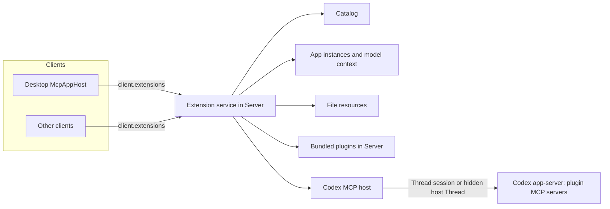

# Plugin Extensions

Plugin Extensions 让插件的 MCP server 在模型工具之外提供产品界面：入口、文件查看器、原生设置、composer 提及、模型上下文和更丰富的表单。Cypheria 实现 [OpenAI MCP Extensions 规范](https://github.com/openai/mcp-extensions/blob/main/docs/spec.md) 的 host 侧，该规范扩展了 MCP 与 [MCP Apps](https://github.com/modelcontextprotocol/ext-apps)。插件生命周期仍由 [Integrations](integrations.zh-CN.md) 负责；本文负责 extension 的发现、Agent 路由、App 托管及其安全。

## 原则

- **插件与 MCP 归 Agent 管理。** Agent 安装插件，并启动、认证和调用 MCP server。Server 从不启动插件的 MCP server，从不连接它，也从不在 Agent 与 server 之间插入代理。
- **Extension 状态归 Server。** Server 把 Agent 报告的内容整理成 catalog，保存 App 实例及其模型上下文，响应文件 resource，并把每个 App 请求路由给某个 Agent。所有客户端看到同一份状态。
- **Extension host session。** 没有已加载对话的界面，其 MCP 调用运行在托管该插件的 Agent 的隐藏、非持久 session 中，对应 ChatGPT Desktop 的 `mcp_extension_host` Thread。
- **Agent 能力不同。** Codex 支持该规范。其他 Agent 暂不提供 extension，缺失的能力不做模拟。
- **Desktop 对齐 ChatGPT Desktop** 的界面与行为，并使用官方 MCP Apps 库（`AppBridge`）处理 App 协议。
- **一个例外。** 内置第一方插件（`code-review`、`cypheria-app-tools`）是 relay 背后的 Server 代码；Server 自己响应它们的 App 请求，因此 Code Review 在没有 Codex 时也能工作。

## 参考：ChatGPT Desktop

本地 `chatgpt-analysis` 工作区分析的 ChatGPT Desktop 构建（26.928.31416）与 Codex 源码显示如下分工：

- **Codex app-server 是 MCP client。** 它负责插件与连接；在 `mcpServerStatus/list` 中报告每个 server 的工具及其原始 `_meta`、`serverInfo` 与 capability；转发 `elicitation/create` 与 `openai/elicitation/create`；解析 `onboardingSkill`；并在模型工具调用上记录 `McpAppUi`（resource URI 与首选显示模式）。它向 MCP server 声明其客户端在 `initialize.capabilities.extensions` 中声明的 MCP extension。
- **MCP 连接属于 Thread。** 每个 Codex Thread 拥有自己的 MCP runtime，因此本地 stdio server 在每个使用它的 Thread 中各运行一次。`mcpServer/tool/call` 必须带 `threadId`。
- **Renderer 负责解读 extension。** 它逐个工具校验 `_meta["openai/ui"]`、设置与提及 capability，构建侧栏、Thread、设置、文件与提及界面，并托管 App。它自己从不连接 MCP server。
- **`mcp_extension_host`。** 没有 Thread 的调用运行在一个以 `ephemeral: true`、`permissions: ":read-only"` 和 `threadSource: "mcp_extension_host"` 启动的隐藏 Thread 中。它在首次使用时创建，遇到 `Transport closed` 时替换一次，其 `thread/started` 事件被忽略。
- **App 运行在沙箱 guest 中**，位于单独的 origin，由只放行白名单消息的 preload 隔离。
- **托管插件** 来自 ChatGPT 插件服务，extension 字段由后端预先计算，并通过 OpenAI 后端调用。Cypheria 不支持它们。

## 架构

`apps/server/src/extensions` 负责 extension service。各 host 实现同一个内部接口 `McpHost`：`BundledMcpHost` 响应内置插件，`CodexMcpHost` 询问 Codex。每个 host 声明它是否报告完整的工具 metadata、能否调用工具、能否读取任意 resource；catalog 与 App 的能力都依照这些声明。

## Codex host

- **客户端 extension。** Codex adapter 在 `initialize` 时声明带 `mimeTypes: ["text/html;profile=mcp-app"]` 的 `io.modelcontextprotocol/ui` 与带 `form` 的 `openai/elicitation`，使 server 发送 App metadata 与扩展表单。
- **清单。** `mcpServerStatus/list` 报告每个 server 及其工具、原始 `_meta`、server 信息与 capability。Codex Apps（`codex_apps`）与 Cypheria 内置插件被排除。
- **Session。** 为某个 Cypheria Thread 中的 App 发起的调用，若该 Thread 的 Codex session 已加载，就在该 session 中运行，使 App 到达产生其结果的 server 实例。其他所有调用运行在一个以 `ephemeral: true`、`permissions: ":read-only"` 和 `threadSource: "mcp_extension_host"` 启动的隐藏 Thread 中。Codex runtime 丢弃该 Thread 的通知，并把它的反向请求交给 extension service。遇到 `Transport closed` 或未知 Thread 时，隐藏 Thread 被替换一次并重试该调用。
- **Elicitation。** 隐藏 Thread 中提出的表单或 URL 请求，发给正在等待该 server 调用结果的客户端；隐藏 Thread 的其他请求一律拒绝。

工具调用最多等待五分钟，读取最多一分钟。

## Catalog

当客户端在一分钟后请求、请求刷新，或插件、marketplace 与 MCP 变更后，catalog 会重建。变化后的 catalog 获得新的 revision，Server 会广播它。与 ChatGPT Desktop 一样，Server 逐个工具校验，并为丢弃的内容记录诊断：

- **入口：** `_meta["openai/ui"].entrypoints`，类型为 `global`（可选 `quickAction`）、`thread`、`file`（扩展名以 `.` 开头）与 `settings`（可选 `searchTerms`）。带入口的工具需要在 `_meta.ui.resourceUri` 中提供 `ui://` resource。
- **设置：** `extensions` 或旧的 `experimental` 下的 server capability `openai/settings`，其 `readTool` 与 `updateTool` 是两个不同且已列出的工具。
- **提及：** capability `openai/mentions.searchTool`（必须只读），或标记了 `_meta["openai/extensions"]["mentions/search"]` 的工具（必须对 App 可见）。

标题依次取 `title`、`annotations.title`、`name`。图标依次取工具的 `icons`、server 图标。Server 只接受 `https:` 与图片 `data:` 图标，并去除 SVG 中的脚本；Desktop 把 SVG 作为 CSS mask 绘制，使 `currentColor` 跟随主题。入口身份为 `[plugin@marketplace, server, tool, type]`，为多个 Agent 启用的插件只出现一次。Desktop 把最近的 catalog 缓存在客户端存储中，使侧栏在 Agent 启动前即可显示插件页面。

## App 实例

App 实例是一个已挂载的 App，身份由 Server 持有。入口与工具调用的实例是共享的，因此在同一对话中显示同一个 App 的所有客户端接入同一个实例；最后一个客户端关闭或断开时实例结束。

- **Global：** global 入口的 App，单独显示或位于对话旁。
- **Thread：** 每个 Thread 与入口组合一个。
- **文件：** 每个 Thread、handler 与文件组合一个。
- **工具调用：** 每个工具声明了 App 的 Timeline 工具项一个。
- **工具：** 临时实例，例如设置布局中的 App 或 Code Review 页面。

入口打开时，Server 调用其工具一次，参数为 `{}` 或文件输入，并保存结果，因此 App 无需再次调用工具即可渲染。工具调用的 App 改用该调用记录下的输入与结果渲染。显示模式取自 resource 的 `_meta["openai/ui"]`：先取 `availableDisplayModes`，否则仅首选模式，否则 `inline` 与 `fullscreen` 两者；从不提供 `pip`。入口默认 `fullscreen`，工具调用默认 `inline`，除非 App 有其他偏好。

## App 发出的请求

Server 在路由之前，按实例检查每个 App 请求：

| 请求 | 行为 |
| :- | :- |
| `tools/call` | 只能发往实例自身的 server：其入口工具，以及 `_meta.ui.visibility` 包含 `app` 的工具。文件实例的调用会加上 `_meta["openai/resource"].path` |
| `resources/read` | 实例的文件，或 server 自身的 resource |
| `ui/update-model-context` | 替换该 App 在其对话中的上下文；见[模型上下文](#模型上下文) |
| `ui/message` | 发送消息到实例所在对话；`_meta["openai/message"].target: "new"` 时发到新对话。没有对话的 App 会新建一个。消息记录 App 作为来源，每分钟最多十条 |
| `resources/subscribe`、`resources/unsubscribe`、`openai/resources/write` | 仅限实例自己的文件；见[文件入口](#文件入口) |
| `openai/files/open` | 对话工作区根目录内的文件，由对话在文件标签页中打开 |
| `cypheria/*` | 仅限内置插件，例如 Code Review 的 `cypheria/codeReview/*`，由 Desktop 响应 |

接受 text、image、resource link 与 embedded resource 块，一次最多 512 KiB；audio 会被拒绝。

## 模型上下文

每个 App 最近一次 `ui/update-model-context` 属于其对话，按 App 所渲染的内容作键，因此重新打开 App 后仍然保留。每个客户端都把可见的块显示为可移除的 composer 附件；`annotations.audience` 不含用户的块发送但不显示，`openai/title` 与 `openai/thumbnail` 作为标签。任一客户端移除块后，通过 `hostContext["openai/modelContext"]` 通知 App。

Global 页面的 App 可以在页面还没有对话时附加上下文。上下文随实例等待，并进入第一条消息创建的对话。页面把 App 移到另一个对话，或移到无对话以开始新对话时，它附加到前一个对话的上下文会一并复制过去。

对话的下一条消息以文本与图片携带所有 App 的上下文，各自位于其 App 名称之下；块的 `_meta` 永不进入模型。该 turn 开始后，上下文被清空，App 收到 `null`。模型上下文保存在 Server 内存中，Server 重启后不保留。

## 文件入口

文件 resource 由 Server 从工作区响应，而不是由插件 server 响应：

1. 文件名与文件入口匹配的文件标签页显示一个查看器栏，包含 Cypheria 自带的查看器和每个匹配的 handler。文件按以下顺序打开：用户为该扩展名选过的查看器；否则在 Cypheria 自带查看器能预览该类型时（图片、Markdown、SVG，以及 CSV 或 TSV 表格）用自带查看器；否则用扩展名匹配最长的 handler。选择查看器时，会以匹配最长的扩展名为键保存到 Server 配置（`workspace.fileViewers`，值为 handler 的入口 ID 或 `builtin`），按扩展名合并，客户端之间不会互相覆盖；所选 handler 已不存在时回到默认顺序。
2. 打开时把不透明的 `cypheria-resource://<instance>/<token>` URI 绑定到该文件的规范路径，它必须是对话工作区根目录内的普通文件。指向根目录之外的符号链接会被拒绝。
3. App 与入口工具收到 `{ file: { name, resourceUri } }`。
4. `resources/read` 按 `_meta["openai/resource"].representation` 或文件内容返回 text 或 base64，并带有 `etag`（内容哈希）与 `writable: true`。
5. `resources/subscribe` 监视文件并发送 `notifications/resources/updated`。
6. `openai/resources/write` 遵循 `ifMatch`，结果为 `saved`、`conflict` 或 `too-large`；文件读写上限 20 MiB，写入是原子的。

## 设置、提及、表单与引导

- **结构化设置。** 插件详情页用原生控件显示每个 server 的设置，按 `layout` 分组，未分组字段位于 **Other settings**。修改时只把变化的值传给更新工具。布局中的工具项运行普通工具并显示其文本，或在模态框中打开 App 工具；设置入口也在那里打开。
- **提及。** 在 composer 中输入 `@` 后，会在五秒内搜索每个插件的提及工具。选中的项成为 `mcp-resource` 引用；发送消息时，Server 通过插件的 host 读取该 resource，传入其文本或图片；无法读取时传入带标签的链接。
- **表单。** Thread interaction 与 extension 调用都用标准字段和 OpenAI 扩展渲染表单 elicitation：`pattern`、选项 `description`、`x-openai-thumbnail`、`x-openai-suggestions`，以及在提供的 resource 中选择的 `x-openai-input`。含有 Cypheria 无法收集字段的表单（例如带上传的 implicit 选择或嵌套对象）只提供 Decline，绝不部分显示。extension 调用产生的 elicitation 只发给发起调用的客户端；turn 中产生的 elicitation 是发给所有已连接客户端的 Thread interaction。
- **引导。** Codex 报告插件 manifest 在 `extensions["com.openai"].onboardingSkill` 中指定的 skill；插件详情页提供 **Set up**，它新建一个运行该 skill 的对话。

## Desktop App host

### 沙箱

- Electron main 在特权 scheme `cypheria-sandbox:` 上提供一个固定的 proxy 页面。每个 App 拥有自己的 origin `cypheria-sandbox://a<Agent、插件、server 与 resource 的哈希>/`，因此有独立的存储，不与 renderer 或其他 App 共享任何东西。
- `McpAppHost` 用沙箱 iframe 嵌入 proxy。`AppBridge` 用 `sendSandboxResourceReady` 响应 proxy 的 `ui/notifications/sandbox-proxy-ready`，发送带有根据 `_meta.ui.csp` 生成的 Content Security Policy 与所声明权限的 App 文档；proxy 把它加载到内层 frame 并转发消息。
- 这些 frame 没有 preload、没有 Node.js、没有 Cypheria IPC。App 内的 frame 不能离开沙箱 origin，链接通过 `ui/open-link` 打开。

### 界面

- **侧栏：** 插件的 global 入口，位于 Code Review 之后。
- **Global 页面：** `/plugins/<plugin>@<marketplace>/app/<tool>`，App 占满页面，右下角浮动一个对话，与 ChatGPT Desktop 的工作区页面相同。第一条消息新建一个普通对话并留在面板中；面板标题可以选择另一个最近的对话、开始新对话，或在对话页面打开该对话。Server 把页面的对话保存为工作区 Thread `mcp-app:<入口>`，因此每个客户端都会回到它。App 跟随面板显示的对话而无需重新打开，App 通过 `ui/message` 开始的对话也在面板中打开。
- **Deep link：** `cypheria://plugins/<plugin>@<marketplace>/app/<tool>?path=<编码后的路径>` 打开 global 页面；App 通过 `hostContext["openai/deepLink"]` 收到该路径。
- **对话侧面板：** 每个 Thread 入口是一个标签页，对话所起始的 global App 也在这里打开。
- **Timeline：** 声明了 App 的工具调用以内联方式显示 App，尺寸由 App 决定，全屏切换保留同一个 frame。
- **文件标签页、插件详情、composer 与表单：** 如上所述。App 发送的用户消息带有该 App 名称的标签。

## 协议

`extensions` capability 包含：

| 消息 | 用途 |
| :- | :- |
| `extension.catalog.get` / `extension.catalog.updated` | Catalog、revision、提供服务的 Agent 与诊断 |
| `extension.app.open` | 为入口、工具调用或工具创建或接入实例 |
| `extension.app.resource.read` | App 文档，以 200,000 字符为单位分段 |
| `extension.app.request` | 某实例的一个 App 请求 |
| `extension.app.notification` | 已打开实例的 MCP 通知与 host context 变更 |
| `extension.app.bind` | 把 global 页面的实例连同其上下文移到另一个对话，或移到无对话 |
| `extension.app.close` | 客户端断开实例 |
| `extension.context.list` / `extension.context.remove` / `extension.context.updated` | 对话的模型上下文 |
| `extension.settings.read` / `extension.settings.update` / `extension.settings.tool` | 结构化设置及其布局工具 |
| `extension.mentions.search` | 提及搜索 |
| `extension.elicitation` / `extension.elicitation.respond` | 客户端的 extension 调用产生的表单 |

通用 Timeline 的 `tool` 项带有可选的 `app`（server、插件、工具、resource URI 与首选显示模式），App 发送的用户消息带有可选的 `origin`。`@cypheria/protocol` 在 `openai-mcp-extensions.ts` 中定义规范的 host 侧 schema；`@openai/mcp-extensions` 面向 `ext-apps` 1.x，不是依赖。

## 安全

- App frame 不可信。它们不获得 token、Server URL、原始路径、私钥或签名能力。
- App 的工具调用不经过模型审批提示。插件 server 不得暴露 Web3 签名；签名仍在 [Web3](web3.zh-CN.md) 所述 Server policy 之后。
- 隐藏的 host Thread 只读且非持久。
- 文件访问按规范路径限制在工作区根目录内，App 只能看到不透明 URI。
- 模型上下文、消息与文件传输有大小限制，消息还有频率限制。

## 限制

> 计划中：以下各项尚未实现。

- Claude：根据 `mcpServerStatus()` 与 `readMcpResource` 只渲染 Claude 工具调用的 App，以及对模型隐藏仅供 App 使用的工具。Pi、OpenCode 与 ACP 不提供 extension。
- Expo 与 CLI 托管 App、设置与提及，以及第三方 `cypheria/*` host 请求。
- 在表单中上传文件，以及 implicit resource 选择。
