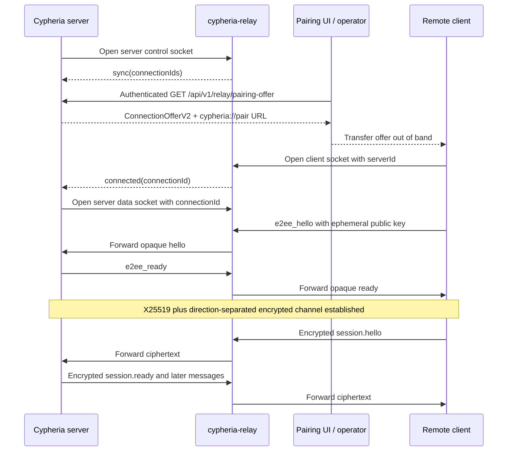
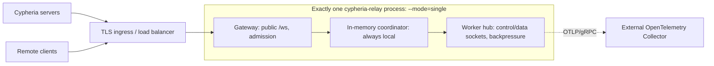
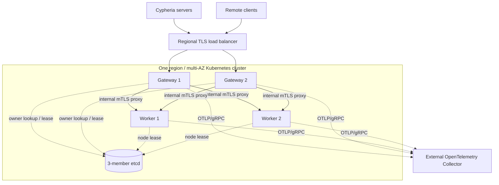

# Cypheria Relay

Cypheria Relay is an optional, end-to-end encrypted path between a remote Cypheria client and
`apps/server`. It is inspired by Paseo Relay's control/data-socket shape, but it is a Cypheria
implementation with no Paseo migration, Cloudflare adapter, or compatibility requirement.

## Trust And Wire Protocol

The public relay endpoint is `/ws` with protocol version `v=2`:

- `role=server&serverId=<id>&v=2` opens the server control socket.
- `role=server&serverId=<id>&connectionId=<id>&v=2` opens one server data socket.
- `role=client&serverId=<id>&v=2` opens a client socket; the relay creates the connection ID.

The control socket receives `sync`, `connected`, and `disconnected` JSON messages. Application
traffic uses one independent data socket per client. The relay validates that the first client
frame is an `e2ee_hello`, then forwards frames without decrypting or parsing them.

`ConnectionOfferV2` contains the server ID, server X25519 public key, and public relay endpoint.
`apps/server` returns it from the authenticated `GET /api/v1/relay/pairing-offer` endpoint and also
encodes it as `cypheria://pair#offer=...`. Possession of a complete offer is the relay-path
capability. A direct-server Bearer token is never included in an offer or sent to the relay.

`@cypheria/relay` performs X25519 key agreement and XSalsa20-Poly1305 authenticated encryption.
Domain-separated client-to-server and server-to-client subkeys prevent reflected ciphertext from
being accepted in the opposite direction. The wire bundle is a 24-byte nonce followed by
ciphertext and its 16-byte authenticator. The plaintext `e2ee_hello` / `e2ee_ready` exchange
negotiates binary ciphertext support; text protocol
messages remain base64-wrapped ciphertext. The channel rejects all-zero shared secrets, bounds its
pre-handshake queue to 200 messages, retries hello every second, and accepts only same-key repeated
hello messages.

## Connection Flow



## Process Modes

The Go binary `cypheria-relay` supports:

```sh
cypheria-relay --mode=single
cypheria-relay --mode=cluster --role=gateway
cypheria-relay --mode=cluster --role=worker
```

`single` is the default. It colocates the public gateway and connection-owning worker and uses an
in-memory coordinator that always selects the local worker. It does not open the internal listener
and explicitly rejects a role, etcd endpoints, an advertised internal address, or internal TLS
files. It may bind a production interface, but this topology must run exactly one relay replica.
Multiple independent single-mode processes behind one load balancer are invalid because a server
control socket and its clients can land on different processes.

`cluster` requires exactly one role. A `gateway` owns public HTTP/WebSocket admission, looks up
ownership in etcd, and proxies each socket to its worker over mTLS. A `worker` registers a leased,
stable node ID and advertised HTTPS address in etcd, owns WebSocket pairs, and forwards opaque
frames. Both roles require etcd and internal mTLS; workers additionally require
`advertise_internal`. Gateways may set `internal_tls.server_name` when worker URLs contain directly
routable Pod IPs but all workers share one certificate identity. The same internal CA/client
certificate is currently used for HTTPS etcd connections, so etcd and worker server certificates
must chain to that CA. Cluster etcd endpoints must use HTTPS.

Separating gateway and worker allows public admission and long-lived, memory-heavy WebSockets to
scale independently. It is not mandatory: `--mode=single` is the smallest production shape when one
process and its restart downtime are acceptable. Regional HA starts with two or three gateways and
two or three workers across availability zones plus an external three-member etcd cluster. Scale
gateways by new-connection rate and workers by active sockets, ingress bytes, queue pressure, and
memory. Each logical remote client normally consumes one client socket and one server data socket,
in addition to one control socket per Cypheria server.

## Deployment Topologies

Single mode uses no etcd. TLS termination may be supplied by the external ingress. The relay
itself remains one failure domain; servers and clients reconnect after the process returns.



Regional HA uses cluster-mode gateway and worker processes plus external etcd.



In coordinated deployments, etcd stores coordination metadata only; owner keys use hashed server
identities:

```txt
/cypheria-relay/v1/nodes/<node-id>
/cypheria-relay/v1/owners/<sha256(server-id)>
```

Workers use a 15-second node lease and self-fence after 10 seconds without renewal. Graceful
shutdown explicitly revokes that lease so the worker registration disappears before `Close`
returns; a crash, forced kill, or etcd outage still falls back to TTL expiry. Rendezvous hashing
chooses an owner when none exists. Owner leases are renewed every 10 seconds while a routed
WebSocket is active and expire after 30 idle seconds. An etcd loss therefore stops an isolated
worker from continuing indefinitely, while payload data never enters etcd.

## Kubernetes Deployment

The Kustomize base at
[`apps/relay/deploy/kustomize/base`](../apps/relay/deploy/kustomize/base) creates a namespace, three
gateway pods behind a ClusterIP Service, three worker pods in a Deployment selected by a headless Service,
topology-spread constraints, resource requests/limits, probes, and disruption budgets. It does not
deploy etcd, an OpenTelemetry Collector, public Ingress, or certificate issuance.

Before applying it:

1. Build and push [`apps/relay/Dockerfile`](../apps/relay/Dockerfile), then set an immutable image tag
   in a Kustomize overlay.
2. Replace the placeholder external etcd endpoint in both `config/*.toml` files. Keep etcd in the
   same low-latency region and provide its own highly available deployment separately.
3. Create `cypheria-relay-gateway-tls` and `cypheria-relay-worker-tls` Secrets in the
   `cypheria-relay` namespace, each with `ca.crt`, `tls.crt`, and `tls.key`. Gateway certificates
   need client authentication; worker certificates need server and client authentication. The
   worker server certificate must cover
   `cypheria-relay-worker.cypheria-relay.svc.cluster.local`.
4. Optionally set `telemetry.otlp_endpoint` or `OTEL_EXPORTER_OTLP_ENDPOINT` in an overlay. The
   referenced Collector must already exist.
5. Put a TLS-terminating Ingress, Gateway API route, or external load balancer in front of only the
   `cypheria-relay-gateway` Service, with WebSocket support and idle timeouts longer than expected
   sessions. Never expose the worker Service publicly.

The namespace and externally issued certificate files can be installed, for example, with:

```sh
kubectl apply -f apps/relay/deploy/kustomize/base/namespace.yaml
kubectl -n cypheria-relay create secret generic cypheria-relay-gateway-tls \
  --from-file=ca.crt=./ca.crt --from-file=tls.crt=./gateway.crt --from-file=tls.key=./gateway.key
kubectl -n cypheria-relay create secret generic cypheria-relay-worker-tls \
  --from-file=ca.crt=./ca.crt --from-file=tls.crt=./worker.crt --from-file=tls.key=./worker.key
```

Render first, then apply:

```sh
kubectl kustomize apps/relay/deploy/kustomize/base
kubectl apply -k apps/relay/deploy/kustomize/base
```

The checked-in endpoint and `latest` image tag are examples, not production defaults. Production
should consume the base through an environment overlay that pins an image digest, supplies the
regional etcd/OTLP addresses, adjusts resources, and adds the public routing resource. Do not use an
HPA for workers until it is driven by active connections, queue pressure, and memory rather than
CPU alone; scale-in drops owned sockets and relies on client/server reconnect.

Workers use a Deployment, not a StatefulSet: they persist no local state. Each Pod uses its UID as
the leased node ID and advertises its directly routable Pod IP; `--advertise-internal-host` safely
formats IPv4 or IPv6 with the configured internal port. Gateways connect to that IP while verifying
the fixed `internal_tls.server_name`. A normally terminated Pod revokes its etcd node lease; an
abruptly lost Pod is removed when the 15-second lease expires. A gateway that encounters the stale
owner key deletes it with a revision-checked transaction and immediately selects a live worker. The
headless Service therefore supplies the shared TLS identity and network policy boundary, not stable
per-Pod identity.

## Deployment Without Kubernetes

Build the static binary with `go build -o cypheria-relay ./cmd/cypheria-relay` from `apps/relay`, or
build the supplied container image. Run it under a supervisor such as systemd, runit, or your
container platform; use a dedicated unprivileged account, a read-only installation, restart on
failure, file-descriptor limits sized for two sockets per remote client, and a graceful-stop window
of at least 45 seconds.

For one host, copy `config/relay.single.example.toml`, leave mode as `single`, and start:

```sh
/usr/local/bin/cypheria-relay --config=/etc/cypheria-relay/relay.toml
```

A minimal systemd unit for either topology is:

```ini
[Unit]
Description=Cypheria Relay
After=network-online.target
Wants=network-online.target

[Service]
User=cypheria-relay
Group=cypheria-relay
ExecStart=/usr/local/bin/cypheria-relay --config=/etc/cypheria-relay/relay.toml
Restart=on-failure
RestartSec=2s
TimeoutStopSec=45s
LimitNOFILE=1048576
NoNewPrivileges=true
PrivateTmp=true
ProtectHome=true
ProtectSystem=strict

[Install]
WantedBy=multi-user.target
```

Install it as `/etc/systemd/system/cypheria-relay.service`, then run
`systemctl daemon-reload && systemctl enable --now cypheria-relay`. The service account needs read
access to the config and, in cluster mode, the TLS files, but no writable application directory.

Run exactly one process and place a TLS reverse proxy or load balancer in front of port 6770. The
proxy must preserve WebSocket upgrades and use a suitably long idle timeout. A process restart is a
relay outage until both sides reconnect.

For non-Kubernetes regional HA, provision external etcd first, then use separate gateway and worker
hosts. Copy the corresponding gateway/worker example TOML to each host, use a unique stable
`node_id`, install CA/certificate/key files with least privilege, and give every worker a stable DNS
name in `network.advertise_internal`. The certificate must match that name. Put only gateways in
the public load-balancer pool; allow gateways to reach worker port 6771, and allow both roles to
reach etcd and the optional OTLP Collector. Start each service with the same `--config` command
above. Deploy and restart one worker at a time before gateways; there is currently no connection
draining protocol, so active sockets on that worker reconnect.

## Capacity And Backpressure

Defaults are a `32 MiB - 14` maximum data frame, 64 KiB control frame, 512 MiB process ingress
budget, 15-second peer-attach timeout, 30-second delivery timeout, and 35-second transport timeout.
The reader reserves one maximum-sized frame from the shared weighted memory budget before reading;
this conservative reservation prevents partial frames from deadlocking the budget under concurrency.
Each destination has a bounded writer queue and one writer goroutine; a full or oversized queue is
closed with a retryable WebSocket status instead of growing without bound. Go's memory limit is
automatically aligned to the container limit at a 0.9 ratio.

## Observability

The relay uses the upstream OpenTelemetry Go SDK only. When `OTEL_EXPORTER_OTLP_ENDPOINT` is set,
metrics are exported every 15 seconds and routing emits short-lived spans over OTLP/gRPC. Current
metrics include connections, rejections, and active connections. Attributes are deliberately
low-cardinality and never contain server IDs, connection IDs, keys, tokens, or payloads. There is
no Prometheus `/metrics` endpoint.

An OpenTelemetry Collector (or compatible collector such as Alloy) is an external deployment
component. It is not implemented or embedded in `apps/relay`; it owns buffering, sampling,
redaction, authentication, and backend routing.

## Configuration

Pass a TOML file with `--config=/path/to/relay.toml` or `CYPHERIA_RELAY_CONFIG_FILE`. Unknown TOML
keys and malformed values fail startup. Precedence is command-line flags, then environment
variables, then TOML, then built-in defaults. Complete examples are provided for
[`single`](../apps/relay/config/relay.single.example.toml),
[`cluster` gateway](../apps/relay/config/relay.gateway.example.toml), and
[`cluster` worker](../apps/relay/config/relay.worker.example.toml).

The TOML sections are:

```toml
mode = "cluster" # single | cluster
role = "worker"  # gateway | worker; cluster only
node_id = "relay-worker-1"

[network]
public_addr = "0.0.0.0:6770"
internal_addr = "0.0.0.0:6771"
advertise_internal = "https://relay-worker-1.example.internal:6771"

[coordination]
etcd_endpoints = ["https://etcd.example.internal:2379"]

[internal_tls]
ca_file = "/etc/cypheria-relay/tls/ca.crt"
cert_file = "/etc/cypheria-relay/tls/tls.crt"
key_file = "/etc/cypheria-relay/tls/tls.key"
# Optional gateway override when advertised worker URLs use Pod IPs.
# server_name = "cypheria-relay-worker.cypheria-relay.svc.cluster.local"

[telemetry]
otlp_endpoint = "otel-collector.example.internal:4317"

[limits]
max_data_bytes = 33554418
max_control_bytes = 65536
ingress_budget_bytes = 536870912

[timeouts]
attach = "15s"
delivery = "30s"
transport = "35s"
```

All application settings also have flags and environment-variable overrides:

```txt
CYPHERIA_RELAY_CONFIG_FILE                  TOML file path
CYPHERIA_RELAY_MODE                         single | cluster
CYPHERIA_RELAY_ROLE                         gateway | worker (cluster only)
CYPHERIA_RELAY_PUBLIC_ADDR                  public listen address
CYPHERIA_RELAY_INTERNAL_ADDR                worker mTLS listen address
CYPHERIA_RELAY_ADVERTISE_INTERNAL           advertised worker URL
CYPHERIA_RELAY_ADVERTISE_INTERNAL_HOST      advertised host/IP; port comes from internal address
CYPHERIA_RELAY_NODE_ID                      stable node ID
CYPHERIA_RELAY_ETCD_ENDPOINTS               comma-separated endpoints
CYPHERIA_RELAY_INTERNAL_CA_FILE             internal CA
CYPHERIA_RELAY_INTERNAL_CERT_FILE           internal certificate
CYPHERIA_RELAY_INTERNAL_KEY_FILE            internal private key
CYPHERIA_RELAY_INTERNAL_SERVER_NAME         gateway worker-certificate name override
CYPHERIA_RELAY_MAX_DATA_BYTES               frame limit
CYPHERIA_RELAY_MAX_CONTROL_BYTES            control-frame limit
CYPHERIA_RELAY_INGRESS_BUDGET_BYTES         process frame-memory budget
CYPHERIA_RELAY_ATTACH_TIMEOUT               duration, for example 15s
CYPHERIA_RELAY_DELIVERY_TIMEOUT             duration, for example 30s
CYPHERIA_RELAY_TRANSPORT_TIMEOUT            duration, for example 35s
OTEL_EXPORTER_OTLP_ENDPOINT                 external OTLP/gRPC receiver
```

Cypheria server relay configuration is:

```txt
CYPHERIA_SERVER_RELAY_ENABLED
CYPHERIA_SERVER_RELAY_ENDPOINT
CYPHERIA_SERVER_RELAY_USE_TLS
CYPHERIA_SERVER_RELAY_PUBLIC_ENDPOINT
CYPHERIA_SERVER_RELAY_PUBLIC_USE_TLS
```

The server's long-lived key is stored atomically with mode `0600` at
`$CYPHERIA_HOME/config/relay-key.json`.

## Regional Scope And Future Global Failover

The implemented system is regional. One Kubernetes cluster stretched across availability zones
provides approximately the same failure-domain effect as Paseo Relay's current regional BEAM
cluster: pod/node/AZ failures are handled inside one low-latency region. Neither etcd nor a BEAM
cluster should be stretched between continents.

Global routing is intentionally designed but not implemented. Each region will run an independent
Kubernetes relay deployment and independent etcd cluster. A future offer can add `homeRegion` and
an ordered `endpoints[]`. `HMAC(serverId)` maps to one of 1024 virtual shards. A vendor-neutral
`GlobalCoordinator` will expose linearizable read/CAS, lease, fencing-generation, and watch
operations backed by a three-region service that tolerates one region failure. It contains only
shard ownership metadata, never relay payloads or keys.

The target global lease is 30 seconds, renewal is 10 seconds, and a region self-fences after 20
seconds without coordination. Failover grants a strictly higher fencing generation before the
backup region admits the shard. Servers and clients reconnect through the offer's ordered fallback
endpoints for a target RTO of 60 seconds. This fencing rule prevents an isolated old home region
from accepting new sessions after global ownership moves.

Collector configuration, live deployment/load validation, and the global coordinator are deferred.
The checked-in Kustomize manifests cover only the relay application and its references to external
dependencies.
