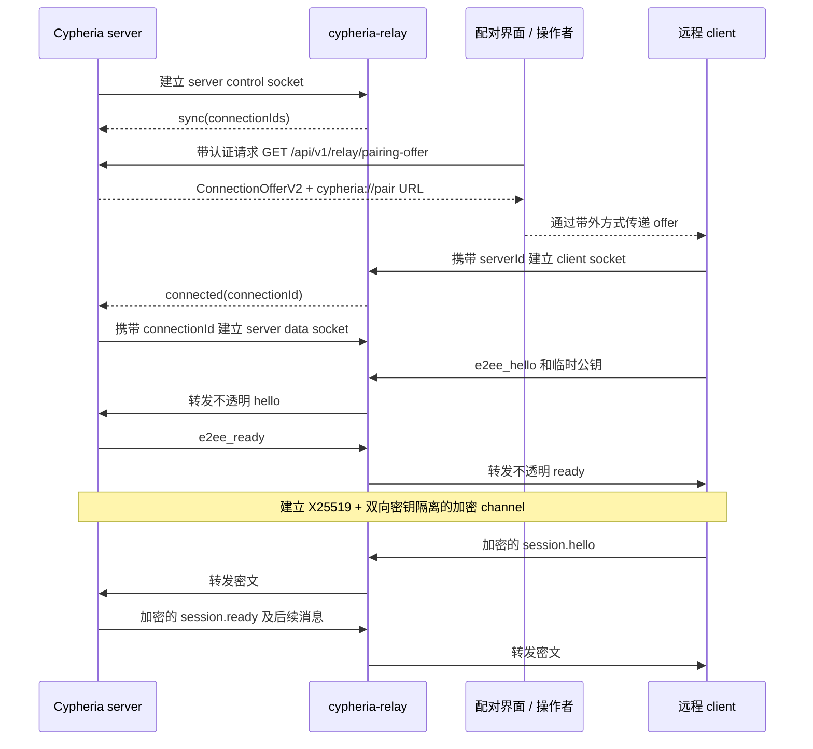
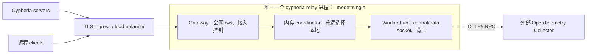
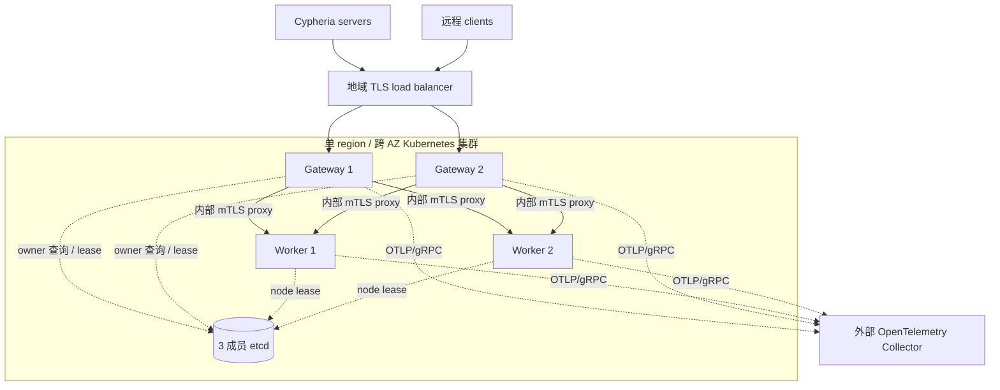

# Cypheria Relay

Cypheria Relay 是远程 Cypheria 客户端与 `apps/server` 之间可选的端到端加密通道。它借鉴
Paseo Relay 的 control/data socket 结构，但属于 Cypheria 自己的实现，不承担 Paseo 迁移、
Cloudflare 适配或兼容性要求。

## 信任边界与线路协议

公网 relay 端点为 `/ws`，协议版本参数是 `v=2`：

- `role=server&serverId=<id>&v=2` 建立服务端 control socket；
- `role=server&serverId=<id>&connectionId=<id>&v=2` 为一个客户端建立服务端 data socket；
- `role=client&serverId=<id>&v=2` 建立客户端 socket，connection ID 由 relay 生成。

control socket 接收 `sync`、`connected`、`disconnected` JSON 消息；每个客户端使用独立的
data socket。relay 仅验证客户端首帧是 `e2ee_hello`，此后不解密、不解析应用帧。

`ConnectionOfferV2` 包含 server ID、服务端 X25519 公钥和公网 relay 端点。`apps/server`
通过受认证的 `GET /api/v1/relay/pairing-offer` 返回 offer，并编码为
`cypheria://pair#offer=...`。完整 offer 本身就是 relay 路径的能力凭证；直连服务端的
Bearer token 不会写入 offer，也绝不会发送给 relay。

`@cypheria/relay` 使用 X25519 密钥协商和 XSalsa20-Poly1305 认证加密。客户端到服务端、
服务端到客户端使用经过 domain separation 的不同子密钥，避免反射密文被反方向接受。
线路数据由 24 字节 nonce、密文和 16 字节认证标签组成。明文 `e2ee_hello` / `e2ee_ready`
仅用于协商二进制密文；文本协议消息仍以 base64 密文承载。实现拒绝全零共享秘密，握手前队列最多 200 条，
每秒重发 hello，并且只接受密钥不变的重复 hello。

## 连接流程



## 进程模式

Go 二进制 `cypheria-relay` 支持：

```sh
cypheria-relay --mode=single
cypheria-relay --mode=cluster --role=gateway
cypheria-relay --mode=cluster --role=worker
```

`single` 是默认值，在一个进程内同时运行公网 gateway 与持有连接的 worker，并使用永远选择
本地 worker 的内存 coordinator。它不启动内部 listener，而且会明确拒绝 role、etcd endpoint、
内部公告地址和内部 TLS 文件。它可以监听生产网络接口，但这种拓扑必须严格只运行一个 relay
副本。不能把多个独立的 single 进程直接放在同一个 load balancer 后面，因为 server control
socket 与 client 可能落到不同进程。

`cluster` 必须且只能选择一个 role。`gateway` 负责公网 HTTP/WebSocket 接入、在 etcd 查询
ownership，并通过 mTLS 把每条 socket 代理到 owner worker。`worker` 向 etcd 注册带租约的稳定
node ID 与 HTTPS 公告地址，持有 WebSocket 对并转发不透明帧。两个 role 都要求 etcd 与内部
mTLS，worker 还必须配置 `advertise_internal`。当 worker URL 使用可直接路由的 Pod IP、但所有
worker 共用一个证书身份时，gateway 可配置 `internal_tls.server_name`。当前 HTTPS etcd 连接
复用内部 CA/client certificate，因此 etcd 与 worker server certificate 必须由同一个 CA 链
签发；cluster 的 etcd endpoint 必须使用 HTTPS。

拆分 gateway/worker 的目的是让公网接入与长连接、内存敏感的数据面独立扩缩容，并非协议
要求。能接受单进程故障域和重启停机时，`--mode=single` 是最小生产形态。地域高可用可从跨
AZ 的 2～3 个 gateway、2～3 个 worker 和外部 3 成员 etcd 起步。gateway 按新建连接速率
扩容，worker 按活跃 socket、入口字节、队列压力和内存扩容。每个远程客户端通常占用一个
client socket 与一个 server data socket；每个 Cypheria server 另有一个 control socket。

## 部署拓扑

`single` 不使用 etcd，TLS 可以由外部 ingress 终止。relay 自身仍是一个故障域；
进程恢复后 server 与 client 会重新连接。



地域高可用使用 cluster 模式的 gateway/worker 进程与外部 etcd。



协同部署中，etcd 只保存协调元数据，其中 owner key 使用哈希后的 server 身份：

```txt
/cypheria-relay/v1/nodes/<node-id>
/cypheria-relay/v1/owners/<sha256(server-id)>
```

worker 节点租约为 15 秒，连续 10 秒无法续租就自我隔离。正常关闭会显式 revoke 该 lease，
因此 `Close` 返回前 worker 注册就已经消失；进程崩溃、强制终止或 etcd 不可达时仍由 TTL
过期兜底。没有 owner 时用 Rendezvous hash 选取 worker。只要还有被路由的 WebSocket，owner
租约每 10 秒续租；空闲 30 秒后过期。因此失去 etcd 的隔离 worker 不会无限期继续服务，
payload 也从不进入 etcd。

## Kubernetes 部署

[`apps/relay/deploy/kustomize/base`](../apps/relay/deploy/kustomize/base) 中的 Kustomize base
会创建 namespace、由 ClusterIP Service 承载的 3 个 gateway pod、由 headless Service 选中的
3 个 worker Deployment pod、拓扑分散约束、资源 request/limit、探针和中断预算。它不会部署
etcd、OpenTelemetry Collector、公网 Ingress 或证书签发组件。

应用前需要：

1. 构建并推送 [`apps/relay/Dockerfile`](../apps/relay/Dockerfile)，然后在 Kustomize overlay
   中固定不可变 image tag；
2. 替换两个 `config/*.toml` 中的外部 etcd 占位地址；etcd 应处于同一低延迟 region，其高可用
   部署独立提供；
3. 在 `cypheria-relay` namespace 创建 `cypheria-relay-gateway-tls` 和
   `cypheria-relay-worker-tls` Secret，每个包含 `ca.crt`、`tls.crt`、`tls.key`；gateway 证书
   需要 client authentication，worker 证书同时需要 server/client authentication，worker
   server certificate 必须覆盖
   `cypheria-relay-worker.cypheria-relay.svc.cluster.local`；
4. 可选地在 overlay 中配置 `telemetry.otlp_endpoint` 或
   `OTEL_EXPORTER_OTLP_ENDPOINT`，其引用的 Collector 必须已经存在；
5. 仅在 `cypheria-relay-gateway` Service 前配置终止 TLS 的 Ingress、Gateway API route 或
   外部 load balancer，并启用 WebSocket、把 idle timeout 设得长于预期会话；绝不能把 worker
   Service 暴露到公网。

例如，可以这样创建 namespace 并安装外部签发的证书文件：

```sh
kubectl apply -f apps/relay/deploy/kustomize/base/namespace.yaml
kubectl -n cypheria-relay create secret generic cypheria-relay-gateway-tls \
  --from-file=ca.crt=./ca.crt --from-file=tls.crt=./gateway.crt --from-file=tls.key=./gateway.key
kubectl -n cypheria-relay create secret generic cypheria-relay-worker-tls \
  --from-file=ca.crt=./ca.crt --from-file=tls.crt=./worker.crt --from-file=tls.key=./worker.key
```

先渲染检查，再应用：

```sh
kubectl kustomize apps/relay/deploy/kustomize/base
kubectl apply -k apps/relay/deploy/kustomize/base
```

仓库中的 etcd 地址和 `latest` image tag 都只是示例，不是生产默认值。生产环境应通过 overlay
消费 base，固定 image digest，提供该 region 的 etcd/OTLP 地址，调整资源，并增加公网路由
资源。在 worker 自动扩缩容能依据活跃连接、队列压力和内存而不是仅依据 CPU 之前，不要添加
HPA；缩容会断开该 worker 持有的 socket，并依赖 client/server 重连。

worker 使用 Deployment 而非 StatefulSet，因为它不持久化本地状态。每个 Pod 用自身 UID 作为
带租约的 node ID，并公告可直接路由的 Pod IP；`--advertise-internal-host` 会使用内部监听端口
正确格式化 IPv4 或 IPv6。gateway 连接该 IP，但校验固定的 `internal_tls.server_name`。正常
终止的 Pod 会主动 revoke node lease；Pod 突然消失时则在 15 秒 lease 到期后移除。gateway
遇到 stale owner key 时，以检查 revision 的事务删除它并立即选择 live worker。因此 headless
Service 提供的是共享 TLS identity 与网络策略边界，而不是稳定的 per-Pod identity。

## 非 Kubernetes 部署

在 `apps/relay` 运行 `go build -o cypheria-relay ./cmd/cypheria-relay` 构建静态二进制，或构建
随附的容器镜像。使用 systemd、runit 或容器平台等 supervisor 托管；采用专用非特权账号、
只读安装目录、失败自动重启、能容纳每个远程 client 两条 socket 的文件描述符上限，以及至少
45 秒的优雅停止窗口。

单主机部署时，复制 `config/relay.single.example.toml`，保持 `single` 模式，然后启动：

```sh
/usr/local/bin/cypheria-relay --config=/etc/cypheria-relay/relay.toml
```

两种拓扑都可以使用下面这个最小 systemd unit：

```ini
[Unit]
Description=Cypheria Relay
After=network-online.target
Wants=network-online.target

[Service]
User=cypheria-relay
Group=cypheria-relay
ExecStart=/usr/local/bin/cypheria-relay --config=/etc/cypheria-relay/relay.toml
Restart=on-failure
RestartSec=2s
TimeoutStopSec=45s
LimitNOFILE=1048576
NoNewPrivileges=true
PrivateTmp=true
ProtectHome=true
ProtectSystem=strict

[Install]
WantedBy=multi-user.target
```

将其安装为 `/etc/systemd/system/cypheria-relay.service`，然后执行
`systemctl daemon-reload && systemctl enable --now cypheria-relay`。service account 需要读取
配置文件，以及 cluster 模式下的 TLS 文件，但不需要可写应用目录。

只运行一个进程，并在 6770 端口前配置 TLS reverse proxy 或 load balancer。代理必须保留
WebSocket upgrade，并使用足够长的 idle timeout。进程重启后，在两端完成重连前 relay 会中断。

非 Kubernetes 地域高可用应先提供外部 etcd，再使用相互独立的 gateway 与 worker 主机。
把对应 gateway/worker TOML 示例复制到每台主机，使用唯一且稳定的 `node_id`，以最小权限安装
CA/certificate/key 文件，并为每个 worker 在 `network.advertise_internal` 配置稳定 DNS；证书
必须匹配该名称。公网 load balancer 只加入 gateway；网络策略允许 gateway 访问 worker 6771，
并允许两个 role 访问 etcd 与可选 OTLP Collector。每个服务都用上面的 `--config` 命令启动。
发布或重启时先逐台 worker、再逐台 gateway；当前没有连接 draining 协议，因此该 worker 的
活跃 socket 会重连。

## 容量与背压

默认 data frame 上限为 `32 MiB - 14`，control frame 为 64 KiB，进程入口内存预算为
512 MiB；对端挂接、投递与传输超时分别为 15、30、35 秒。读取方会在读取前从共享加权
内存预算中保守预留一个最大 frame，避免多个不完整 frame 在并发时耗尽预算并互相等待。
每个目的连接只有一个 writer goroutine 和有界队列；队列已满或超限时用可重试 WebSocket
状态关闭连接，而不是无限增长。Go 内存上限自动按容器限制的 0.9 设置。

## 可观测性

relay 只使用上游 OpenTelemetry Go SDK。配置 `OTEL_EXPORTER_OTLP_ENDPOINT` 后，每 15 秒通过
OTLP/gRPC 导出 metrics，路由只产生短生命周期 span。目前的指标包括连接、拒绝和活跃连接数。
属性严格保持低基数，不包含 server ID、connection ID、密钥、token 或 payload。服务没有
Prometheus `/metrics` 端点。

OpenTelemetry Collector（或 Alloy 等兼容 Collector）是外部部署组件，不在 `apps/relay`
中实现或嵌入。缓冲、采样、脱敏、认证与后端路由都由外部 Collector 负责。

## 配置

使用 `--config=/path/to/relay.toml` 或 `CYPHERIA_RELAY_CONFIG_FILE` 传入 TOML 文件。未知
TOML key 和格式错误的值会让启动直接失败。优先级依次是 command-line flag、环境变量、TOML、
内置默认值。仓库提供完整的 [`single`](../apps/relay/config/relay.single.example.toml)、
[`cluster` gateway](../apps/relay/config/relay.gateway.example.toml) 和
[`cluster` worker](../apps/relay/config/relay.worker.example.toml) 示例。

TOML 结构如下：

```toml
mode = "cluster" # single | cluster
role = "worker"  # gateway | worker；仅 cluster 使用
node_id = "relay-worker-1"

[network]
public_addr = "0.0.0.0:6770"
internal_addr = "0.0.0.0:6771"
advertise_internal = "https://relay-worker-1.example.internal:6771"

[coordination]
etcd_endpoints = ["https://etcd.example.internal:2379"]

[internal_tls]
ca_file = "/etc/cypheria-relay/tls/ca.crt"
cert_file = "/etc/cypheria-relay/tls/tls.crt"
key_file = "/etc/cypheria-relay/tls/tls.key"
# 当公告的 worker URL 使用 Pod IP 时，可选的 gateway override。
# server_name = "cypheria-relay-worker.cypheria-relay.svc.cluster.local"

[telemetry]
otlp_endpoint = "otel-collector.example.internal:4317"

[limits]
max_data_bytes = 33554418
max_control_bytes = 65536
ingress_budget_bytes = 536870912

[timeouts]
attach = "15s"
delivery = "30s"
transport = "35s"
```

所有应用配置也都有 flag 与环境变量 override：

```txt
CYPHERIA_RELAY_CONFIG_FILE                  TOML 文件路径
CYPHERIA_RELAY_MODE                         single | cluster
CYPHERIA_RELAY_ROLE                         gateway | worker（仅 cluster）
CYPHERIA_RELAY_PUBLIC_ADDR                  公网监听地址
CYPHERIA_RELAY_INTERNAL_ADDR                worker mTLS 监听地址
CYPHERIA_RELAY_ADVERTISE_INTERNAL           worker 公告 URL
CYPHERIA_RELAY_ADVERTISE_INTERNAL_HOST      公告 host/IP；端口取自内部监听地址
CYPHERIA_RELAY_NODE_ID                      稳定节点 ID
CYPHERIA_RELAY_ETCD_ENDPOINTS               逗号分隔的 etcd 端点
CYPHERIA_RELAY_INTERNAL_CA_FILE             内部 CA
CYPHERIA_RELAY_INTERNAL_CERT_FILE           内部证书
CYPHERIA_RELAY_INTERNAL_KEY_FILE            内部私钥
CYPHERIA_RELAY_INTERNAL_SERVER_NAME         gateway 的 worker 证书名称 override
CYPHERIA_RELAY_MAX_DATA_BYTES               帧上限
CYPHERIA_RELAY_MAX_CONTROL_BYTES            control frame 上限
CYPHERIA_RELAY_INGRESS_BUDGET_BYTES         进程帧内存预算
CYPHERIA_RELAY_ATTACH_TIMEOUT               duration，例如 15s
CYPHERIA_RELAY_DELIVERY_TIMEOUT             duration，例如 30s
CYPHERIA_RELAY_TRANSPORT_TIMEOUT            duration，例如 35s
OTEL_EXPORTER_OTLP_ENDPOINT                 外部 OTLP/gRPC 接收端
```

Cypheria server 的 relay 配置为：

```txt
CYPHERIA_SERVER_RELAY_ENABLED
CYPHERIA_SERVER_RELAY_ENDPOINT
CYPHERIA_SERVER_RELAY_USE_TLS
CYPHERIA_SERVER_RELAY_PUBLIC_ENDPOINT
CYPHERIA_SERVER_RELAY_PUBLIC_USE_TLS
```

服务端长期密钥以 `0600` 模式原子保存在 `$CYPHERIA_HOME/config/relay-key.json`。

## 地域范围与未来全局故障转移

当前实现是单地域系统。一个跨可用区的 Kubernetes 集群，与 Paseo Relay 当前地域内 BEAM
集群达到的故障域效果大致相同：在一个低延迟地域内处理 pod、节点和 AZ 故障。etcd 与 BEAM
集群都不应跨洲拉伸部署。

全局路由已经完成设计但尚未实现。每个 region 将运行相互独立的 Kubernetes relay 和 etcd
集群；未来 offer 可增加 `homeRegion` 与有序 `endpoints[]`。`HMAC(serverId)` 映射至 1024 个
虚拟 shard。厂商无关的 `GlobalCoordinator` 将提供线性一致 read/CAS、lease、fencing
generation 和 watch 接口，底层采用能容忍一个 region 故障的三地域服务。它只存 shard 所有权
元数据，不保存 relay payload 或密钥。

目标全局 lease 为 30 秒，每 10 秒续租；region 连续 20 秒失去协调能力后自我隔离。故障转移
必须先给备用 region 分配严格更大的 fencing generation，它才能接收该 shard。server 和
client 按 offer 中的有序备用端点重连，目标 RTO 为 60 秒。这条 fencing 规则能阻止失联的旧
home region 在全局所有权转移后继续接收新会话。

Collector 配置、实际部署/负载验证与 GlobalCoordinator 暂缓。仓库中的 Kustomize 清单只覆盖
relay 应用及其对外部依赖的引用。
